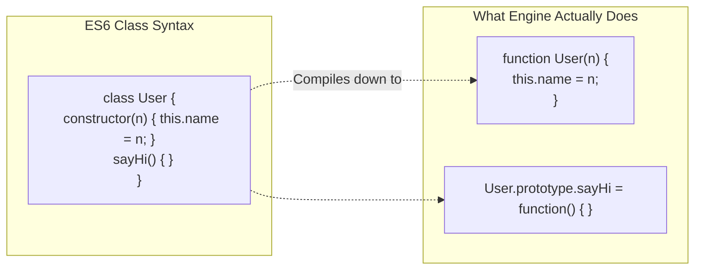

## TL;DR

Introduced in ES6, **Classes** in JavaScript are NOT like classes in Java or C++. They do not introduce a new object-oriented inheritance model. They are purely **Syntactic Sugar** over JavaScript's existing Prototype-based inheritance. They make code easier to read for developers coming from other languages.

## Mental Model



## How It Works

Under the hood, a `class` is just a special type of function.
- The `constructor()` method becomes the actual function body.
- Any methods defined inside the class are automatically attached to the function's `.prototype`.
- The `extends` keyword automatically sets up the `__proto__` chain between the child class and parent class.
- The `super()` keyword calls the parent constructor.

**Differences from regular functions:**
1. You *must* call a class with the `new` keyword. Calling `User()` without `new` throws an error.
2. Code inside a class is strictly evaluated in Strict Mode (`"use strict"`).
3. Class methods are non-enumerable (they won't show up in a `for...in` loop).

## Example

```javascript
// --- ES6 Class ---
class Animal {
  constructor(name) {
    this.name = name;
  }
  speak() {
    console.log(`${this.name} makes a noise.`);
  }
}

class Dog extends Animal {
  constructor(name, breed) {
    super(name); // Must call super before 'this' can be used!
    this.breed = breed;
  }
  speak() {
    console.log(`${this.name} barks.`);
  }
}

const d = new Dog("Rex", "German Shepherd");
d.speak(); // "Rex barks."
```

## Common Output Question

```javascript
class Point {
  constructor(x, y) {
    this.x = x;
    this.y = y;
  }
  
  static distance(a, b) {
    return Math.hypot(a.x - b.x, a.y - b.y);
  }
}

const p1 = new Point(5, 5);
console.log(p1.distance);
```
**Q: What does this output and why?**
**A:** `undefined`.
The `static` keyword attaches the method directly to the `Point` class function itself, NOT to `Point.prototype`. Therefore, instances of the class (`p1`) cannot access it. It must be called as `Point.distance(p1, p2)`.

## Senior Interview Question

**Q: In ES2022, private class fields (`#`) were introduced. How do they differ conceptually from using closures or Symbols for privacy?**

**A:** Prior to ES2022, true privacy in JavaScript required closures (which cost memory because each instance needed its own copy of the methods accessing the closure) or WeakMaps. 
The new `#` syntax (`#privateField`) is enforced strictly by the engine at runtime. If you try to access `instance.#privateField` from outside the class, the engine throws a hard Syntax Error. It is impossible to bypass, even using reflection or Prototype Pollution, making it the most robust form of data encapsulation currently available in JavaScript.
