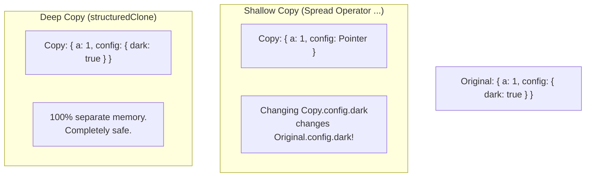

## TL;DR

Because Objects and Arrays are Reference Types, doing `const a = b` only copies the pointer, not the data. To truly duplicate data, you must perform a copy.
- **Shallow Copy**: Copies the top level of properties. If a property is a nested object, the pointer to that nested object is copied.
- **Deep Copy**: Recursively copies every single level, completely severing all memory links to the original object.

## Mental Model



## How It Works

**Shallow Copy Techniques:**
- Spread Operator: `const copy = { ...obj }`
- `Object.assign()`: `const copy = Object.assign({}, obj)`
- Array slicing: `const arrCopy = arr.slice()`

**Deep Copy Techniques:**
- `JSON.parse(JSON.stringify(obj))` (Historically the most common, but breaks on Dates, Functions, and undefined).
- `structuredClone(obj)` (The modern native solution introduced in 2022).
- `_.cloneDeep(obj)` (Using the Lodash library).

## Example

```javascript
const user = {
  name: "Alice",
  settings: { theme: "light" }
};

// --- Shallow Copy ---
const shallow = { ...user };
shallow.name = "Bob"; // Safe! Top-level primitive.
shallow.settings.theme = "dark"; // DANGER!

console.log(user.name); // "Alice" (Unaffected)
console.log(user.settings.theme); // "dark" (The original was mutated!)

// --- Deep Copy (Modern Way) ---
const deep = structuredClone(user);
deep.settings.theme = "blue";

console.log(user.settings.theme); // Remains "dark". 100% severed.
```

## Common Output Question

```javascript
const original = {
  date: new Date(),
  func: () => console.log("Hi"),
  undef: undefined
};

const copy = JSON.parse(JSON.stringify(original));
console.log(copy);
```
**Q: What does the `copy` object look like?**
**A:** 
`{ date: "2023-10-25T12:00:00.000Z" }`
The JSON deep clone trick is heavily flawed. `JSON.stringify` ignores functions and `undefined` properties completely, stripping them out of the resulting string. It also converts `Date` objects into ISO strings, losing their Date prototype methods.

## Senior Interview Question

**Q: Why doesn't `structuredClone()` solve all our problems? Are there things it still can't copy?**

**A:** While `structuredClone()` is a massive improvement over the JSON hack (it handles Dates, Sets, Maps, and circular references perfectly), it still has limitations by design. It **cannot clone Functions or DOM elements**. If you attempt to `structuredClone({ click: function(){} })`, it will throw a `DataCloneError`. Functions are tied closely to their execution contexts and closures, making them inherently unsafe to clone generically across memory spaces.
