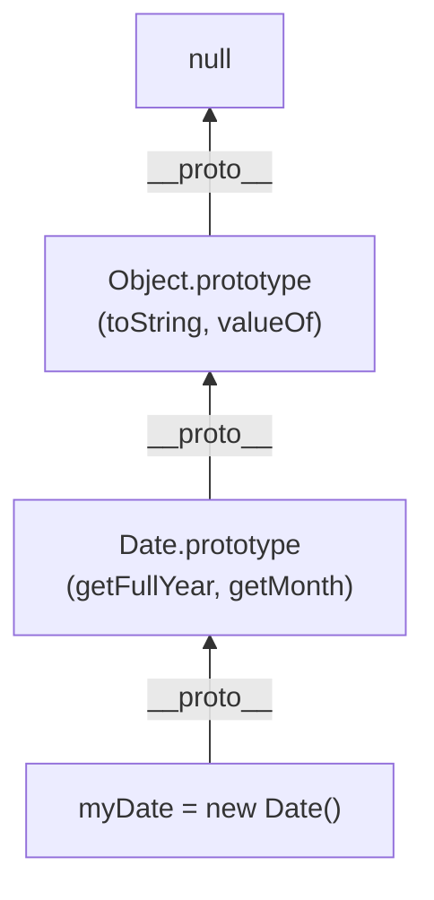

## TL;DR

The **Prototype Chain** is the series of links the JavaScript engine traverses when trying to read a property on an object. It follows the `__proto__` references upwards from object to prototype, to prototype of prototype, until it hits `null`. If it reaches `null` without finding the property, it returns `undefined`.

## Mental Model



## How It Works

**Property Lookup Algorithm:**
1. Check if the property exists directly on the object (Local property).
2. If yes, return it.
3. If no, look at the object's `__proto__`.
4. Check if the property exists on that prototype.
5. If no, look at the prototype's `__proto__`.
6. Repeat until `__proto__` is `null`. Return `undefined`.

**The Top of the Chain:**
Almost every object in JavaScript eventually inherits from `Object.prototype`. The `__proto__` of `Object.prototype` is strictly `null`. This represents the absolute end of the chain.

## Example

```javascript
const obj = {}; // Shorthand for new Object()

// 1. We ask for obj.toString()
// 2. Engine checks obj. Does it have toString? No.
// 3. Engine follows __proto__ to Object.prototype.
// 4. Does Object.prototype have toString? Yes!
console.log(obj.toString()); // "[object Object]"

// Creating an object with NO prototype (breaks the chain)
const pureObject = Object.create(null);

console.log(pureObject); // {}
// console.log(pureObject.toString()); // TypeError: pureObject.toString is not a function
```

## Common Output Question

```javascript
function Animal() {}
Animal.prototype.speak = function() { return "Roar"; };

const dog = new Animal();

console.log(dog.__proto__ === Animal.prototype);
console.log(Animal.__proto__ === Function.prototype);
console.log(Function.prototype.__proto__ === Object.prototype);
```
**Q: What does this output?**
**A:** `true`, `true`, `true`.
1. `dog` was created by `Animal`, so its prototype is `Animal.prototype`.
2. `Animal` is a function. Functions are objects! All functions inherit from `Function.prototype` (which gives them access to `.call()`, `.bind()`).
3. `Function.prototype` is just a normal object, so it inherits from the master `Object.prototype`.

## Senior Interview Question

**Q: Explain the performance implications of the Prototype Chain. What happens if a property doesn't exist?**

**A:** The longer the prototype chain, the slower the property lookup. If you try to access a property that *does not exist* anywhere in the chain, the JavaScript engine is forced to traverse the *entire* chain all the way up to `Object.prototype` and finally `null` before giving up and returning `undefined`. In performance-critical loops (like gaming or high-frequency trading apps), looking up non-existent properties on deep prototype chains can cause severe CPU bottlenecks.
