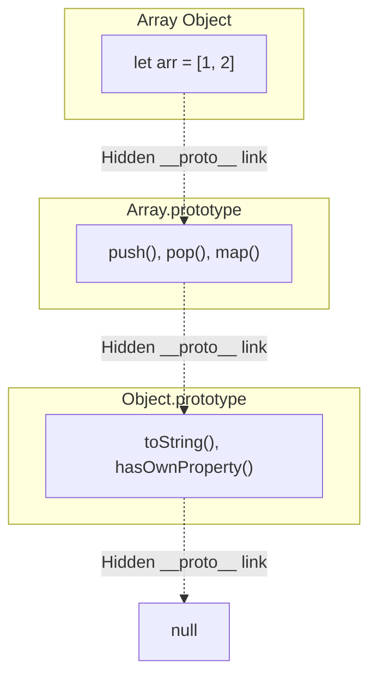

## TL;DR

Unlike Java or C# which use Class-based inheritance, JavaScript uses **Prototypal Inheritance**. Every object in JavaScript has a hidden internal property called `[[Prototype]]` (accessible via `__proto__` or `Object.getPrototypeOf()`) that acts as a fallback. If you ask an object for a property it doesn't have, it silently looks at its Prototype to see if it has it instead.

## Mental Model



## How It Works

When you create an array `let arr = [1, 2]`, the array object itself does *not* contain the `push` or `map` functions. That would waste massive amounts of memory if every single array had its own copy of those functions.

Instead, JavaScript creates the array with a hidden link to the master `Array.prototype` object. When you type `arr.push(3)`, the engine:
1. Looks at `arr`. Does it have a `push` property? No.
2. Follows the `__proto__` link to `Array.prototype`. Does it have `push`? Yes! It executes it.

This allows millions of objects to share the exact same methods in memory.

## Example

```javascript
// A simple object
const animal = {
  eats: true,
  walk() {
    console.log("Animal walk");
  }
};

// Create a new object that uses 'animal' as its prototype
const rabbit = Object.create(animal);
rabbit.jumps = true;

// rabbit doesn't have 'eats', but it inherits it from animal!
console.log(rabbit.eats); // true
rabbit.walk(); // "Animal walk"

// We can override inherited methods
rabbit.walk = function() {
  console.log("Bounce bounce");
};
rabbit.walk(); // "Bounce bounce" (It found it on rabbit, so it stopped looking)
```

## Common Output Question

```javascript
function User(name) {
  this.name = name;
}

User.prototype.isAdmin = false;

const alice = new User("Alice");
const bob = new User("Bob");

alice.isAdmin = true;

console.log(alice.isAdmin);
console.log(bob.isAdmin);
```
**Q: What is the output?**
**A:** `true` and `false`.
When we do `alice.isAdmin = true`, we are NOT modifying the prototype. We are adding a brand new local property directly onto the `alice` object. This "shadows" the prototype's property. 
When we check `bob.isAdmin`, `bob` doesn't have a local `isAdmin` property, so he falls back to the `User.prototype` and finds `false`.

## Senior Interview Question

**Q: What is "Prototype Pollution" and why is it a massive security risk in Node.js?**

**A:** Prototype Pollution occurs when a hacker finds a vulnerability (often in a deep merge or clone function) that allows them to modify the global `Object.prototype`. 
If a hacker can trick a merge function into executing `obj["__proto__"]["isAdmin"] = true`, they just added `isAdmin: true` to the master `Object.prototype`. 
Suddenly, *every single object in your entire application* (that doesn't explicitly have its own `isAdmin` property) will now evaluate `user.isAdmin === true`. This allows attackers to bypass authentication checks or crash servers.
