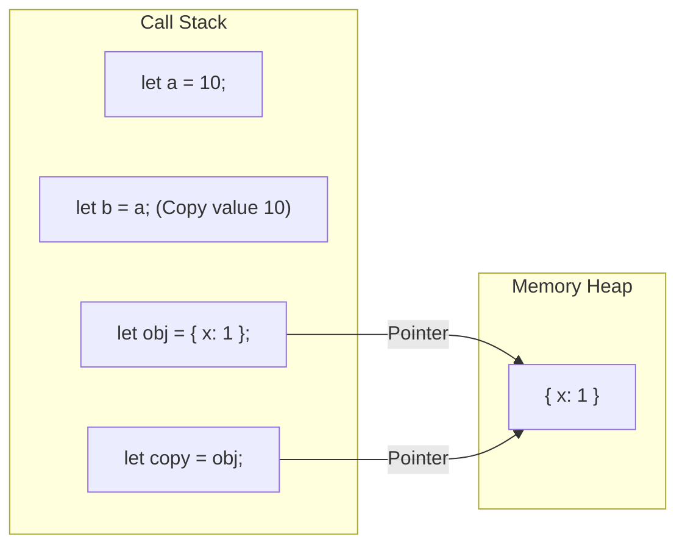

## TL;DR

JavaScript has two categories of data:
- **Primitives** (Number, String, Boolean, Null, Undefined, Symbol, BigInt): Stored directly in the variable's memory location (Stack). Copied by **Value**.
- **References** (Objects, Arrays, Functions): Stored in the Heap. The variable in the stack only holds a *pointer* (reference) to the heap location. Copied by **Reference**.

## Mental Model



## Example

### Primitives (Pass by Value)
```javascript
let x = 10;
let y = x; // Creates a complete copy of the value '10'

y = 20;
console.log(x); // 10 (x is unaffected)
```

### Reference Types (Pass by Reference)
```javascript
let arr1 = [1, 2, 3];
let arr2 = arr1; // Copies the POINTER, not the array itself

arr2.push(4);
console.log(arr1); // [1, 2, 3, 4] (Both variables point to the same array!)
```

## Interview Questions

### How do you safely copy an object without mutating the original?
You must create a **Shallow Copy** or a **Deep Copy**.
- **Shallow Copy**: `const copy = { ...obj }` or `Object.assign({}, obj)`. This copies the top-level properties. However, if the object contains nested objects, those nested objects are still copied by reference!
- **Deep Copy**: `const deepCopy = structuredClone(obj)` (Modern JS) or `JSON.parse(JSON.stringify(obj))`. This recursively copies all nested data, severing all references.

### Is JavaScript pass-by-value or pass-by-reference?
Technically, JavaScript is **always pass-by-value**. However, when you pass an object to a function, the "value" being passed is the *reference* (the memory address). Therefore, mutating the object's properties inside the function affects the outside object. But if you *reassign* the variable entirely inside the function, it will not affect the outside variable.

```javascript
function modify(obj) {
    obj.age = 30; // Mutates original (shared reference)
    obj = { name: "Bob" }; // Reassigns local variable only! Original is untouched.
}
```

## Common Gotchas

*   **Comparing Objects**: `{} === {}` is **false**. Two objects are only strictly equal if they reference the exact same location in memory, even if they have identical properties.

## Remember

> Primitives are immutable and compared by their actual value. Objects are mutable and compared by their memory address.
