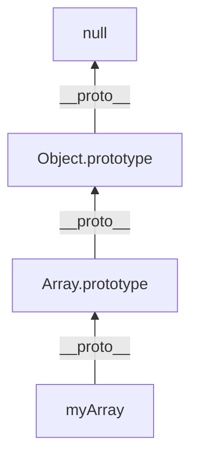

## TL;DR

JavaScript uses **Prototypal Inheritance**. Objects can inherit properties and methods from other objects via a hidden linkage called the Prototype Chain.

## Mental Model


*When you call `myArray.map()`, the engine checks `myArray`. Not finding it, it traverses up the `__proto__` link to `Array.prototype` where `map` is defined.*

## Example

```javascript
// Constructor Function
function Animal(name) {
    this.name = name;
}

// Adding a method to the prototype
Animal.prototype.speak = function() {
    console.log(`${this.name} makes a noise.`);
};

const dog = new Animal("Rex");
dog.speak(); // "Rex makes a noise."

// The chain: dog ---> Animal.prototype ---> Object.prototype ---> null
console.log(dog.__proto__ === Animal.prototype); // true
```

## How It Works

1. **`__proto__` (or `[[Prototype]]`)**: Every object has a hidden property linking it to its prototype.
2. **`.prototype`**: Every *function* has a `.prototype` property. When a function is used as a constructor with `new`, the newly created object's `__proto__` is pointed to the constructor's `.prototype`.
3. **Property Lookup (Delegation)**: If you try to access a property on an object and it doesn't exist, JavaScript looks at the object's `__proto__`. If it's not there, it looks at the `__proto__` of the `__proto__`, continuing up the **prototype chain** until it reaches `null`.

## Interview Questions

### What is the difference between `__proto__` and `prototype`?
- `prototype` is a property exclusively found on **Functions**. It is the blueprint used to assign `__proto__` to instances created by that function.
- `__proto__` is an internal property of **Objects** that points to the actual prototype object it inherits from.

### How do ES6 Classes relate to Prototypes?
ES6 `class` syntax is primarily "syntactic sugar" over JavaScript's existing prototypal inheritance. Under the hood, classes still create constructor functions and attach methods to the `.prototype` object.

### How can you create an object without a prototype?
Use `Object.create(null)`. This creates a completely empty dictionary object that does not inherit from `Object.prototype` (so it has no `.toString()` or `.hasOwnProperty()`).

## Common Gotchas

*   **Adding arrays/objects to `prototype`**: If you attach a reference type (like an array) directly to a constructor's `.prototype`, *all instances will share the exact same array*. Modifying it on one instance will modify it for all.
*   **Performance**: Deep prototype chains can negatively impact performance during property lookups.

## Remember

> Objects inherit from objects. If a property isn't found locally, JS walks up the chain to ask the parent.
