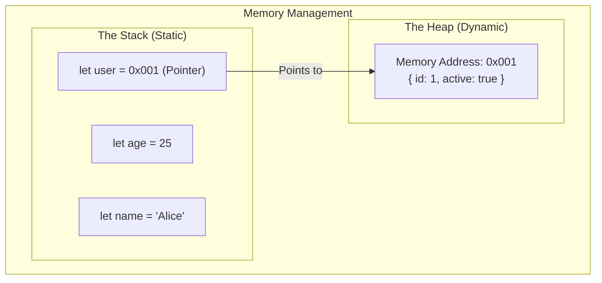

## TL;DR

JavaScript automatically allocates memory when you create variables and frees it when they are no longer needed. It uses two distinct memory structures:
- **The Stack**: Static memory allocation. Stores Primitive types (Number, String, Boolean) and function execution contexts. It is fast but limited in size.
- **The Heap**: Dynamic memory allocation. Stores Reference types (Objects, Arrays, Functions). It is massive but slower to access.

## Mental Model



## How It Works

**The Stack (Static Allocation)**
When you declare a primitive variable (`let age = 25`), the JavaScript engine knows exactly how many bytes of memory a number takes. Because the size is fixed and known at compile time, it places it directly onto the Call Stack. Stack memory is incredibly fast because it works sequentially (LIFO).

**The Heap (Dynamic Allocation)**
When you create an object or array (`let user = {}`), the engine doesn't know how big it will eventually get. You might push 10 items or 10,000 items into it later. Therefore, it allocates a chunk of memory in the Heap—a large, unorganized region of memory. 
It then places a *pointer* (the memory address) on the Stack. When you type `user.id`, the engine looks at the Stack to find the pointer, follows the pointer to the Heap, and retrieves the data.

## Example

```javascript
// 1. Stored directly on the Stack
let score = 100;
let isActive = true;

// 2. Stored on the Heap. The Stack only holds a pointer.
const player = {
  name: "Mario",
  lives: 3
};

// 3. 'backup' gets a copy of the pointer. 
// Now two variables on the Stack point to the exact same Heap object!
const backup = player; 
```

## Common Output Question

```javascript
let a = 10;
let b = a;
a = 20;

let obj1 = { val: 10 };
let obj2 = obj1;
obj1.val = 20;

console.log(b);
console.log(obj2.val);
```
**Q: What is the output?**
**A:** `10` and `20`.
Because `a` is a primitive, `b = a` copies the actual value `10` into a new slot on the Stack. Changing `a` does not affect `b`.
Because `obj1` is a reference type, `obj2 = obj1` copies the *pointer*. Both variables point to the same object on the Heap. Changing the object via `obj1` affects `obj2`.

## Senior Interview Question

**Q: Explain how Closures interact with the Stack and the Heap.**

**A:** Normally, when a function finishes executing, its Execution Context is popped off the Stack, and all its local primitive variables are destroyed. However, if a Closure is formed (an inner function referencing an outer variable), the JavaScript engine cannot destroy that variable. To prevent the data from disappearing when the stack frame pops, the V8 engine is smart enough to move closure-referenced variables *off the Stack and onto the Heap*. This allows the inner function to continue accessing the data long after the outer function has died.
