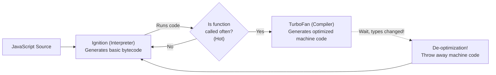

## TL;DR

JavaScript is an interpreted language, which means it should theoretically be very slow. However, modern engines like Google's V8 (used in Chrome and Node.js) use a **JIT (Just-In-Time) Compiler**. It profiles your code while it runs, and if a function is executed frequently, it compiles it down into highly optimized machine code.

## Mental Model



## How It Works: Hidden Classes & Inline Caching

Unlike C++, JavaScript objects are dynamic; you can add or remove properties at any time. This makes property lookup slow. V8 solves this using **Hidden Classes (Shapes)**. 

When you create an object, V8 creates a hidden C++ class. If you create a second object with the *exact same properties in the exact same order*, V8 reuses that hidden class.

**Inline Caching (IC)**: If V8 notices that a function always receives an object of the exact same Hidden Class, it optimizes the function. Instead of looking up `obj.x` every time, it hardcodes the memory offset.

If you suddenly pass an object with a *different* shape, V8 panics, throws away the optimized machine code, and falls back to the slow interpreter. This is called a **De-optimization**.

## Example: Breaking the Optimizer

```javascript
function processUser(user) {
  // If 'user' always has the same shape, V8 makes this lightning fast.
  return user.name + " is " + user.age;
}

const u1 = { name: "Alice", age: 25 }; 
const u2 = { name: "Bob", age: 30 };
processUser(u1);
processUser(u2); // FAST: Same shape!

// --- The Bad Way ---
const u3 = { age: 22, name: "Charlie" }; 
// SLOW: Properties are in a different order! V8 creates a new Hidden Class.
processUser(u3); // DE-OPTIMIZATION triggers!

const u4 = { name: "Dave" };
u4.age = 40; 
// SLOW: Adding properties after creation changes the Hidden Class!
```

## Common Output Question

```javascript
const arr = [1, 2, 3, 4, 5];
delete arr[2];
console.log(arr.length);
console.log(arr[2]);
```
**Q: What is the output, and why is this terrible for performance?**
**A:** `5` and `undefined`.
Deleting an element from an array does not shift the other elements; it leaves a "hole". The array becomes a **Sparse Array** (`[1, 2, empty, 4, 5]`). 
V8 normally stores arrays in contiguous, highly optimized C++ memory blocks. The moment you introduce a hole via `delete`, V8 instantly de-optimizes the array and downgrades it to a slow hash-map (Dictionary Mode). Always use `arr.splice()` or `arr.filter()` instead.

## Senior Interview Question

**Q: What is Monomorphic, Polymorphic, and Megamorphic code, and why does it matter?**

**A:** These terms describe how many different Hidden Classes (Shapes) are passed into a specific function.
- **Monomorphic (1 shape):** The function always receives the exact same object shape. V8 optimizes this to the extreme (inline caching). It is insanely fast.
- **Polymorphic (2-4 shapes):** The function receives a few different shapes. V8 handles this okay by keeping a small switch statement of memory offsets.
- **Megamorphic (5+ shapes):** The function receives tons of different shapes. V8 gives up completely. It stops trying to inline cache and uses slow, generic hash-table lookups for every single property access.
*Takeaway:* Try to always initialize objects with the same properties in the same order, and avoid dynamically adding/removing properties later.
