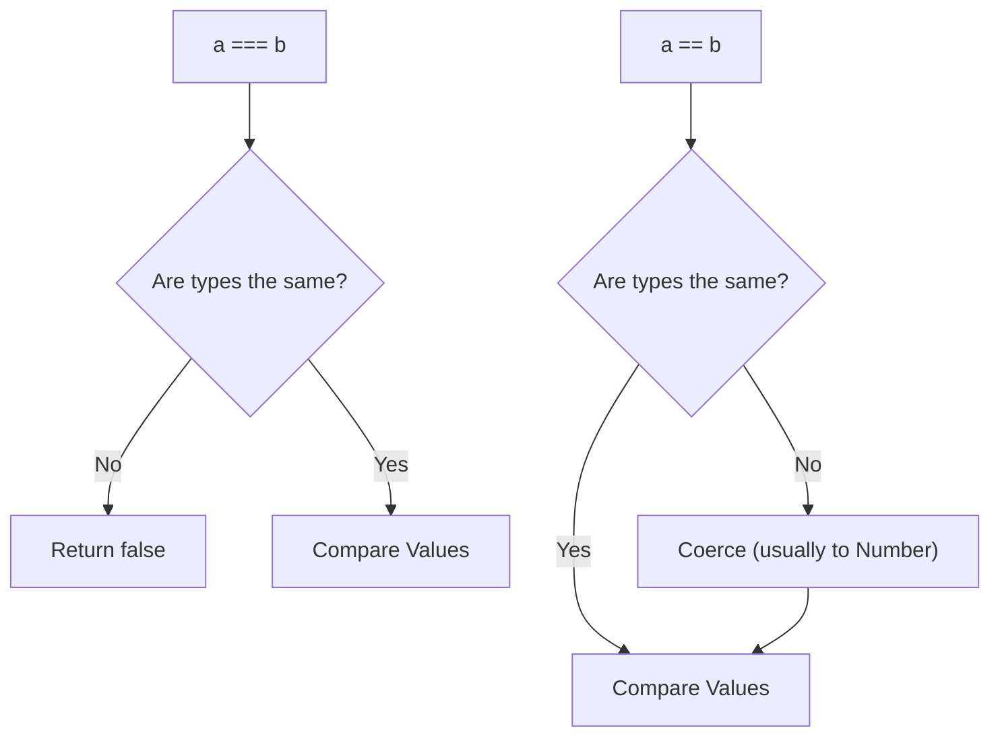

## TL;DR

**Type Coercion** is the automatic or implicit conversion of values from one data type to another (such as strings to numbers).
- `==` (Loose Equality): Performs type coercion before comparing.
- `===` (Strict Equality): Checks both value AND type without coercion.

## Mental Model



## Example

```javascript
// Loose Equality (==)
console.log(5 == "5");      // true (String coerced to Number)
console.log(0 == false);    // true (Boolean coerced to Number: 0)
console.log("" == 0);       // true (Empty string coerced to 0)
console.log(null == undefined); // true (Special rule)

// Strict Equality (===)
console.log(5 === "5");     // false (Different types)
console.log(0 === false);   // false
console.log(null === undefined); // false
```

## Explicit vs Implicit Coercion

*   **Explicit**: You intentionally convert the type. `Number("5")` or `String(123)`.
*   **Implicit**: JS does it for you.
    *   `+` operator: If any operand is a string, it concatenates. `5 + "5" = "55"`.
    *   `-`, `*`, `/` operators: Always coerce strings to numbers. `"10" - 5 = 5`.

## Interview Questions

### What are "Falsy" values in JavaScript?
There are exactly 6 falsy values in JS. If coerced to a boolean (e.g., in an `if` statement), they evaluate to `false`.
1. `false`
2. `0` (and `-0`, `0n`)
3. `""` (empty string)
4. `null`
5. `undefined`
6. `NaN`
Everything else (including empty arrays `[]` and empty objects `{}`) is **Truthy**.

### What does `NaN === NaN` evaluate to?
**`false`**. `NaN` (Not a Number) is the only value in JavaScript that is not strictly equal to itself. To check if a value is `NaN`, you must use `Number.isNaN(val)`.

### Why does `typeof null` return `"object"`?
It is an infamous, unfixable bug in the original implementation of JavaScript. `null` is a primitive value, not an object. Fixing it now would break millions of legacy websites.

## Remember

> **Always use `===`**. Relying on `==` introduces unpredictable coercion rules that lead to subtle bugs. The only acceptable use case for `==` is `val == null` (which conveniently checks for both `null` and `undefined`).
