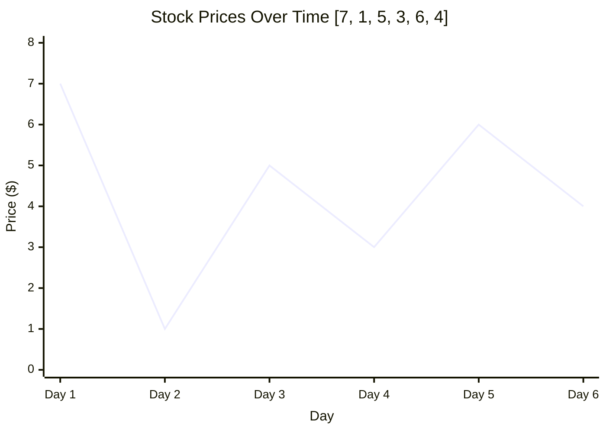

## Problem Statement

You are given an array `prices` where `prices[i]` is the price of a given stock on the `i`th day.

You want to maximize your profit by choosing a **single day** to buy one stock and choosing a **different day in the future** to sell that stock.

Return the maximum profit you can achieve from this transaction. If you cannot achieve any profit, return `0`.

**Example:**
Input: `prices = [7,1,5,3,6,4]`
Output: `5`
Explanation: Buy on day 2 (price = 1) and sell on day 5 (price = 6), profit = 6 - 1 = 5. Note that buying on day 2 and selling on day 1 is not allowed because you must buy before you sell.

### Visual Representation



## Approach: Sliding Window (Two Pointers)

To maximize our profit, we want to buy at the absolutely lowest price possible, and sell at the absolutely highest price *after* that buy date.

We can solve this efficiently in one pass using a **Sliding Window** (which in this case is effectively managed by Two Pointers).

1. Initialize a `left` pointer (buy day) at index `0`.
2. Initialize a `right` pointer (sell day) at index `1`.
3. Keep track of a `maxProfit` variable initialized to `0`.
4. While the `right` pointer hasn't reached the end of the array:
   - **Profitable Transaction:** If `prices[left] < prices[right]`, it means buying at `left` and selling at `right` is profitable! 
     - Calculate the current profit: `prices[right] - prices[left]`.
     - Update `maxProfit` if this current profit is greater than our previous `maxProfit`.
   - **Found a new low:** If `prices[left] >= prices[right]`, it means our current sell day is actually *cheaper* than our buy day! This is a fantastic opportunity. Because we want to buy at the lowest possible price, we should immediately slide our `left` pointer to point to this new lowest price at `right`.
   - Regardless of the condition, increment the `right` pointer by 1 to check the next day.
5. Return the `maxProfit`.

> NOTE: Why jump `left` all the way to `right` when a lower price is found? 
> Because any day between `left` and `right` had a price higher than `prices[left]`. Therefore, `prices[right]` is strictly the lowest price we have seen so far, making it the mathematically optimal new buying point.

## Solution (JavaScript)

```javascript
/**
 * @param {number[]} prices
 * @return {number}
 */
function maxProfit(prices) {
    let left = 0; // Buy
    let right = 1; // Sell
    let maxProfit = 0;

    while (right < prices.length) {
        // If it's a profitable transaction
        if (prices[left] < prices[right]) {
            const profit = prices[right] - prices[left];
            maxProfit = Math.max(maxProfit, profit);
        } else {
            // We found a new, even lower price! Slide the buy pointer to this day.
            left = right;
        }
        
        // Always move the right pointer to the next day
        right++;
    }

    return maxProfit;
}
```

## Complexity Analysis

- **Time Complexity:** $O(n)$ where $n$ is the number of days (the length of the `prices` array). We only iterate through the array once using the `right` pointer.
- **Space Complexity:** $O(1)$ since we are only using a few variables (`left`, `right`, `maxProfit`) and no dynamically sized data structures.
