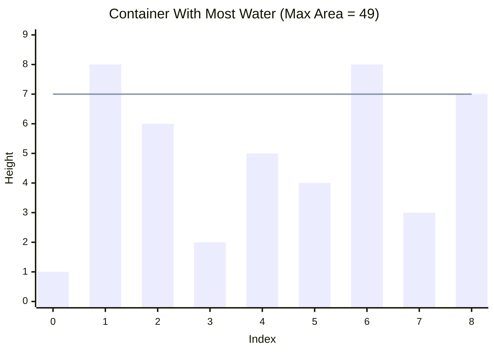

### Leetcode [#11](https://leetcode.com/problems/container-with-most-water/)

## Problem Statement

You are given an integer array `height` of length `n`. There are `n` vertical lines drawn such that the two endpoints of the `i`th line are `(i, 0)` and `(i, height[i])`.
Find two lines that together with the x-axis form a container, such that the container contains the most water.
Return the **maximum amount of water a container can store**.
*Notice that you may not slant the container.*

Example:
Input: height = [1,8,6,2,5,4,8,3,7]
Output: 49
Explanation: The vertical lines are drawn at index 1 (height 8) and index 8 (height 7). The distance between them is 7. The container height is limited by the shorter line (7). The area is 7 * 7 = 49.

### Visual Representation



## Approach: Two Pointers (Greedy)

The amount of water a container can hold is determined by two factors:
1. The **width** (distance between the two lines).
2. The **height** (bottlenecked by the shorter of the two lines).

Formula: `Area = width * min(height_left, height_right)`

A brute-force approach would check every single pair of lines, resulting in an $O(n^2)$ time complexity. We can optimize this to $O(n)$ using the **Two Pointers** technique by making a greedy choice.

We start by maximizing the **width**: we place our `left` pointer at the very beginning of the array and our `right` pointer at the very end. 

We then calculate the area. To potentially find a *larger* area in subsequent steps, we must sacrifice some width. Because the width is strictly decreasing at every step, the **only way** we could possibly get a larger area is if we find a taller line to compensate for the lost width.

Therefore, we must **move the pointer pointing to the shorter line**. Moving the taller line inward would be pointless, because the water level is always bottlenecked by the shorter line anyway.

1. Initialize `left = 0` and `right = height.length - 1`.
2. Initialize `maxArea = 0` to track the maximum water contained.
3. Start a `while` loop that runs as long as `left < right`.
4. Calculate the current area: `min(height[left], height[right]) * (right - left)`.
5. Update `maxArea` if the current area is greater.
6. Check which line is shorter:
   - If `height[left] < height[right]`, increment `left` to search for a taller left line.
   - Otherwise, decrement `right` to search for a taller right line.
7. Return `maxArea` once the pointers meet.

## Solution (JavaScript)

```javascript
/**
 * @param {number[]} height
 * @return {number}
 */
function maxArea(height) {
    let left = 0;
    let right = height.length - 1;
    let maxArea = 0;
    
    while (left < right) {
        // The height of the water is limited by the shorter line
        const currHeight = Math.min(height[left], height[right]);
        const currWidth = right - left;
        
        const currArea = currHeight * currWidth;
        maxArea = Math.max(maxArea, currArea);
        
        // Move the pointer of the shorter line inward
        if (height[left] < height[right]) {
            left++;
        } else {
            right--;
        }
    }
    
    return maxArea;
}
```

## Complexity Analysis

- **Time Complexity:** $O(n)$ where $n$ is the length of the `height` array. The `left` and `right` pointers start at opposite ends and move strictly inward one step at a time until they meet. We evaluate each line exactly once.
- **Space Complexity:** $O(1)$ auxiliary space. We only allocate a few integer variables (`left`, `right`, `maxArea`) to track our state, meaning the memory used does not scale with the size of the input array.
