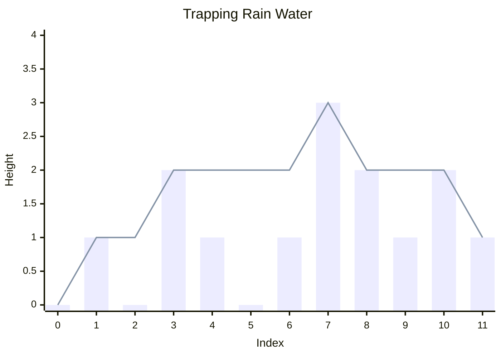

### Leetcode [#42](https://leetcode.com/problems/trapping-rain-water/)

## Problem Statement

Given `n` non-negative integers representing an elevation map where the width of each bar is `1`, compute how much water it can trap after raining.

Example:
Input: height = [0,1,0,2,1,0,1,3,2,1,2,1]
Output: 6
Explanation: The above elevation map is represented by array [0,1,0,2,1,0,1,3,2,1,2,1]. In this case, 6 units of rain water are being trapped.

### Visual Representation



## Approach: Two Pointers

To calculate the amount of water trapped above any specific bar at index `i`, we need to know the highest bar to its left (`maxLeft`) and the highest bar to its right (`maxRight`). 

The water trapped at `i` is determined by the formula:
`Water[i] = min(maxLeft, maxRight) - height[i]` (if this value is positive)

A common approach is to pre-compute two arrays: one storing the `maxLeft` for every index, and one storing the `maxRight`. However, this requires $O(n)$ extra space. We can optimize this to **$O(1)$ space** using **Two Pointers**.

Since the formula depends on `min(maxLeft, maxRight)`, we don't actually need to know *both* maximums. We only need to know whichever one is strictly smaller, because the smaller one acts as the bottleneck!

1. Place `left` pointer at `0` and `right` pointer at the end of the array.
2. Track the maximum heights seen so far from both sides: `maxLeft = height[left]` and `maxRight = height[right]`.
3. Initialize `trappedWater = 0`.
4. While `left < right`:
   - If `maxLeft < maxRight`:
     - This means the water level at the `left` pointer is bottlenecked by `maxLeft`. (Even if there are taller bars somewhere in the middle, `maxLeft` is the limiting factor).
     - Move `left` pointer inwards (`left++`).
     - Update `maxLeft = max(maxLeft, height[left])`.
     - Add `maxLeft - height[left]` to `trappedWater`.
   - Else (`maxRight <= maxLeft`):
     - The water level at the `right` pointer is bottlenecked by `maxRight`.
     - Move `right` pointer inwards (`right--`).
     - Update `maxRight = max(maxRight, height[right])`.
     - Add `maxRight - height[right]` to `trappedWater`.
5. Return `trappedWater`.

## Solution (JavaScript)

```javascript
/**
 * @param {number[]} height
 * @return {number}
 */
function trap(height) {
    if (!height || height.length === 0) return 0;
    
    let left = 0;
    let right = height.length - 1;
    
    let maxLeft = height[left];
    let maxRight = height[right];
    
    let trappedWater = 0;
    
    while (left < right) {
        if (maxLeft < maxRight) {
            left++;
            maxLeft = Math.max(maxLeft, height[left]);
            trappedWater += (maxLeft - height[left]);
        } else {
            right--;
            maxRight = Math.max(maxRight, height[right]);
            trappedWater += (maxRight - height[right]);
        }
    }
    
    return trappedWater;
}
```

## Complexity Analysis

- **Time Complexity:** $O(n)$ where $n$ is the length of the `height` array. The `left` and `right` pointers move strictly inward towards each other, meaning each element in the array is evaluated exactly once.
- **Space Complexity:** $O(1)$ auxiliary space. Unlike the Dynamic Programming approach which requires arrays to store the left and right maxes, this solution only uses a few integer variables (`left`, `right`, `maxLeft`, `maxRight`, `trappedWater`).
