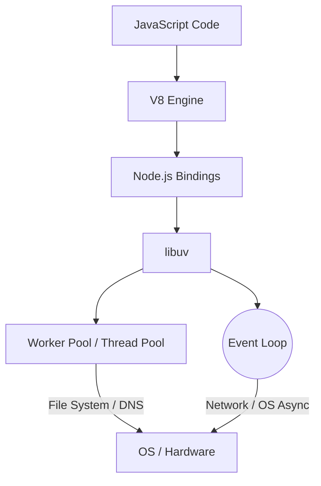

## TL;DR

Node.js runs JavaScript on a single thread (V8 engine), but achieves high concurrency by offloading I/O operations to the OS kernel or a background thread pool managed by **libuv**.

## Mental Model



## Example

```javascript
const fs = require('fs');
const crypto = require('crypto');

// 1. Synchronous (Blocks V8 thread)
console.log("Start");

// 2. Offloaded to libuv thread pool (File I/O)
fs.readFile('large-file.txt', () => {
    console.log("File read complete");
});

// 3. Offloaded to libuv thread pool (CPU intensive cryptography)
crypto.pbkdf2('password', 'salt', 100000, 512, 'sha512', () => {
    console.log("Hash complete");
});

console.log("End");
```

## How It Works

1.  **V8 Engine**: Compiles and executes JavaScript. It has a single Call Stack and Memory Heap.
2.  **libuv**: A C library providing asynchronous I/O based on event loops.
    *   **Network I/O**: libuv uses the OS's native async capabilities (epoll on Linux, kqueue on macOS). No threads are blocked.
    *   **File I/O & Heavy Crypto**: The OS often doesn't have good async file APIs. So, libuv uses a **Thread Pool** (default size: 4 threads) to run these tasks without blocking the main V8 thread.

## Interview Questions

### Is Node.js completely single-threaded?
No. The *JavaScript execution* is single-threaded (in V8). However, the underlying C++ libraries (libuv) use a thread pool for certain operations (fs, dns, crypto), and network I/O is handled concurrently by the OS.

### Why is Node.js bad for heavy CPU tasks like video encoding?
Because video encoding runs entirely inside the V8 JavaScript thread. Since there is only one thread, it blocks the Event Loop. No other HTTP requests can be handled until the encoding finishes.

### How do you fix CPU-blocking code in Node.js?
By using `worker_threads` to spawn separate V8 isolates running in parallel, or by creating separate child processes.

## Common Gotchas

*   **`process.env.UV_THREADPOOL_SIZE`**: The default thread pool size is 4. If you fire 5 `fs.readFile` calls simultaneously, the 5th one must wait for one of the first 4 to finish. This can unexpectedly throttle your application.

## Remember

> Node.js is **single-threaded for JS**, but **multi-threaded for I/O** under the hood.
