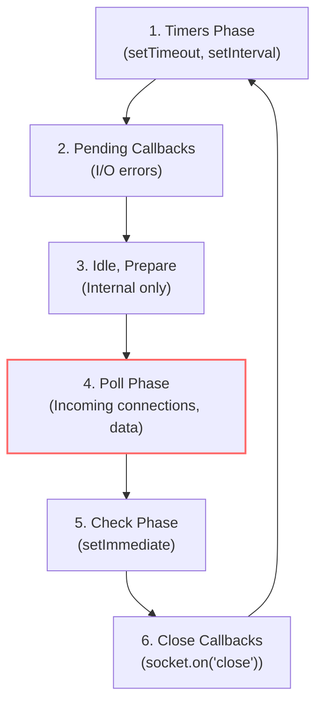

## TL;DR

The **Event Loop** is what allows Node.js to perform non-blocking I/O operations despite JavaScript being single-threaded. Unlike the browser event loop, the Node.js event loop runs in specific **phases**, each with its own queue of callbacks.

## Mental Model



*(Note: Microtasks, like Promises and `process.nextTick`, are executed **between** every single phase!)*

## How It Works (The Phases)

1.  **Timers**: Executes callbacks scheduled by `setTimeout()` and `setInterval()`.
2.  **Pending Callbacks**: Executes I/O callbacks deferred to the next loop iteration (e.g., TCP errors).
3.  **Poll**: Retrieves new I/O events; executes I/O related callbacks (almost all, with the exception of close callbacks, timers, and `setImmediate()`). Node will block here if the other queues are empty.
4.  **Check**: Executes `setImmediate()` callbacks.
5.  **Close Callbacks**: Executes close events (e.g., `socket.on('close', ...)`).

## Example

```javascript
const fs = require('fs');

fs.readFile(__filename, () => {
  console.log('1. I/O Callback (Poll Phase)');

  setTimeout(() => console.log('2. setTimeout (Timers Phase)'), 0);
  setImmediate(() => console.log('3. setImmediate (Check Phase)'));
});

// Output order: 1 -> 3 -> 2
// Why? Once Poll finishes the readFile callback, it moves to the Check phase next!
```

## Common Interview Questions

### What is the difference between the Node.js Event Loop and the Browser Event Loop?
The browser event loop is simpler: it has one Macrotask queue and one Microtask queue. Node.js uses `libuv`, which splits the macrotask queue into distinct phases (Timers, Poll, Check) that execute in a specific round-robin order.

### At what phase does Node.js spend most of its time?
The **Poll phase**. If there are no timers waiting, Node.js waits in the Poll phase for incoming I/O events (like HTTP requests) to arrive.
