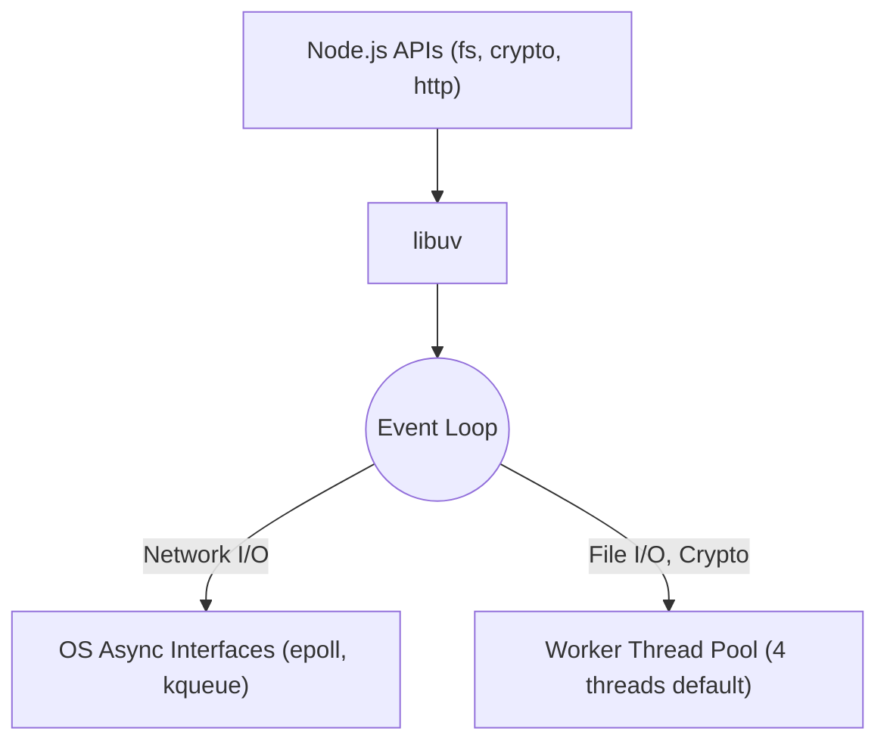

## TL;DR

**libuv** is a multi-platform C library that provides support for asynchronous I/O based on event loops. It is the core engine behind Node.js's non-blocking architecture, handling everything from reading files to establishing network connections.

## Mental Model



## How It Works

When Node.js encounters an asynchronous operation, it hands it off to `libuv`.
1.  **Network Operations**: `libuv` delegates these directly to the OS's native async interfaces (like `epoll` on Linux or `kqueue` on macOS).
2.  **File Systems & Heavy Computation**: Because OS interfaces for file systems are inconsistent, `libuv` uses a **Worker Thread Pool** to execute file operations, DNS lookups, and crypto hashing (like `pbkdf2`) without blocking the main event loop.

## Example

```javascript
const crypto = require('crypto');

const start = Date.now();

// This is offloaded to libuv's Thread Pool
crypto.pbkdf2('password', 'salt', 100000, 512, 'sha512', () => {
  console.log(`1: ${Date.now() - start}ms`);
});

// If we do this 5 times, the 5th will take longer 
// because the default thread pool only has 4 threads!
```

## Common Interview Questions

### How can you change the size of the libuv thread pool?
You can change the number of threads by setting the `UV_THREADPOOL_SIZE` environment variable before running your Node app (e.g., `UV_THREADPOOL_SIZE=8 node app.js`). The max size is 1024.

### Does `libuv` use the thread pool for HTTP requests?
No. Network I/O is handled by the operating system's native asynchronous polling mechanisms (`epoll`, `kqueue`), not the thread pool. The thread pool is mainly for `fs`, `crypto`, `zlib`, and `dns.lookup`.
