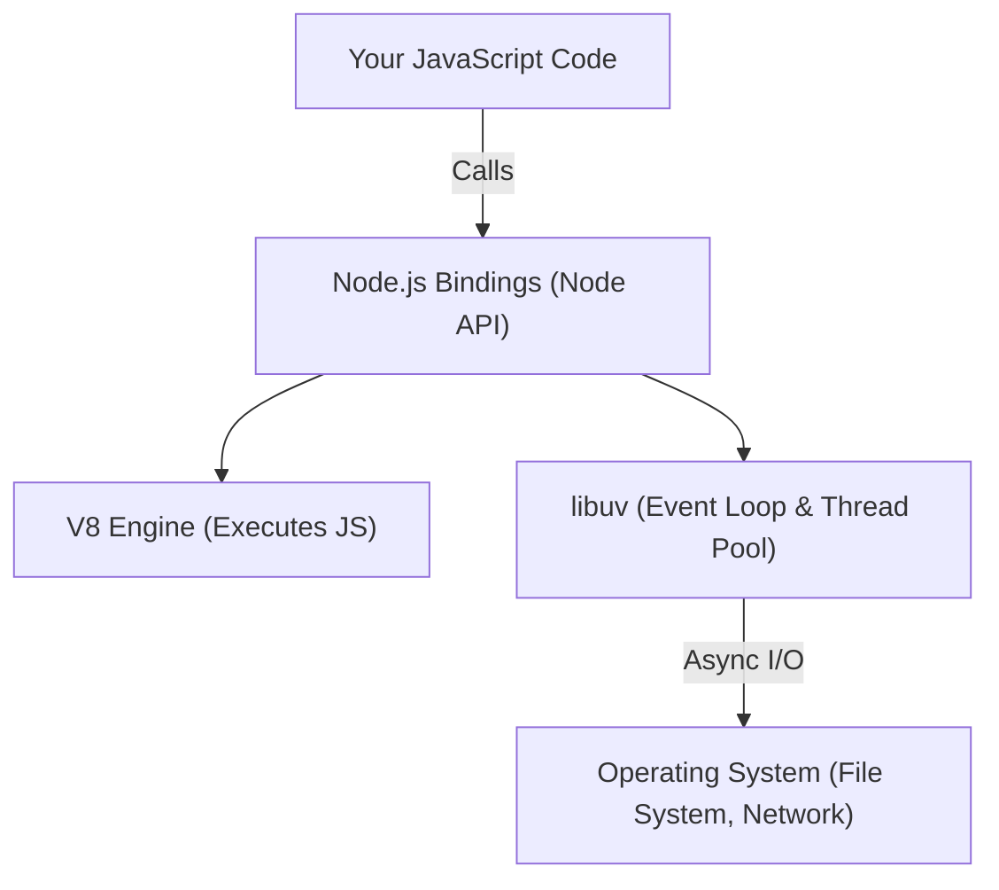

## TL;DR

Node.js is not a language or a framework; it's a **C++ program** that wraps Google's V8 JavaScript Engine and `libuv` (a C library) to allow JavaScript to run outside the browser and perform asynchronous I/O operations.

## Mental Model



## How It Works

1.  **V8 Engine**: Converts JavaScript code into machine code that the processor can understand.
2.  **libuv**: Provides the Event Loop and the Worker Thread Pool. It handles all asynchronous I/O operations (reading files, making network requests).
3.  **Node Bindings**: C++ code that acts as a bridge, allowing JavaScript running in V8 to communicate with `libuv` and other C/C++ libraries.

## Example

```javascript
const fs = require('fs'); // A core module mapped via Node bindings

// The JS runs in V8, but reading the file is delegated to libuv
fs.readFile('data.txt', (err, data) => {
    if (err) throw err;
    console.log(data.toString());
});
console.log('Reading file...'); 
// 'Reading file...' prints first because libuv handles the I/O in the background
```

## Common Interview Questions

### What is the difference between V8 and libuv?
V8 executes your synchronous JavaScript code and performs memory allocation. `libuv` handles the asynchronous operations (like file system and network calls) via the event loop and thread pool.

### Is Node.js completely single-threaded?
No. The **Event Loop** (which executes your JS code) is single-threaded. However, `libuv` maintains a hidden **Thread Pool** (usually 4 threads by default) to handle heavy operations like file I/O or crypto, making Node.js multi-threaded under the hood.
