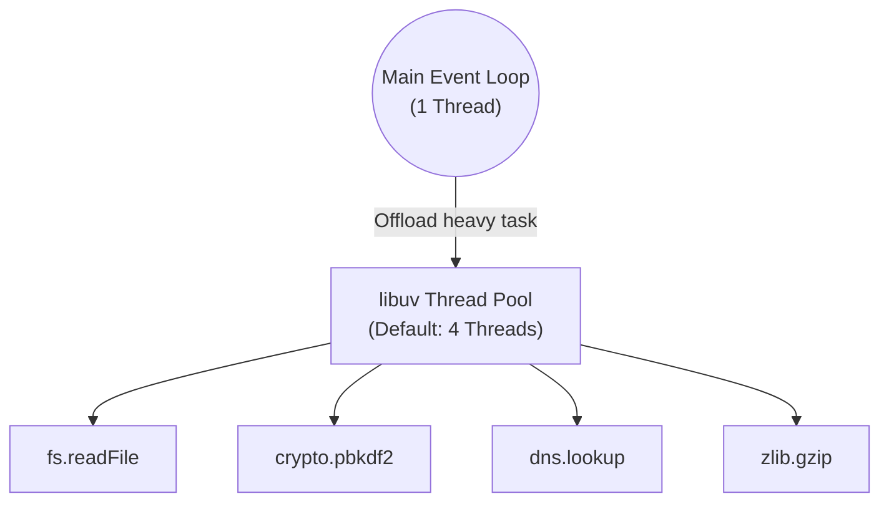

## TL;DR

The **Worker Thread Pool** is a collection of threads maintained by `libuv` used to handle heavy, synchronous tasks that the OS cannot execute asynchronously. This prevents heavy operations from blocking the main Event Loop.

## Mental Model



## How It Works

By default, the thread pool has **4 threads**. When Node encounters specific operations, it hands them off to a thread in this pool.

Operations that use the Thread Pool:
1.  **File System (`fs`)**: Almost all `fs` operations.
2.  **Cryptography (`crypto`)**: E.g., `crypto.pbkdf2`, `crypto.randomBytes`, `crypto.scrypt`.
3.  **Compression (`zlib`)**: All zlib functions.
4.  **DNS**: Specifically `dns.lookup()`.

## Example

```javascript
const crypto = require('crypto');
const start = Date.now();

// Because the default pool size is 4, running this 5 times
// will cause the 5th execution to wait until one of the first 4 finishes.
for (let i = 0; i < 5; i++) {
  crypto.pbkdf2('password', 'salt', 100000, 512, 'sha512', () => {
    console.log(`Hash ${i + 1} took: ${Date.now() - start}ms`);
  });
}
```

## Common Interview Questions

### If Node is single-threaded, how does it read files without blocking?
It uses the `libuv` thread pool. The main thread delegates the file read operation to one of the worker threads in the pool. When the worker thread is done, it notifies the main event loop, which then executes the callback.

### How do you increase the thread pool size?
By setting `process.env.UV_THREADPOOL_SIZE` before the Node.js application starts (or passing it via the command line). The maximum size is 1024.
