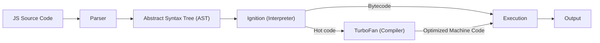

## TL;DR

The **V8 Engine** is Google's open-source, high-performance JavaScript and WebAssembly engine written in C++. It takes your JavaScript code and compiles it directly to native machine code before executing it, rather than interpreting it in real-time.

## Mental Model



## How It Works

V8 uses a Just-In-Time (JIT) compilation pipeline:
1.  **Ignition (Interpreter)**: Quickly generates unoptimized bytecode to start execution immediately.
2.  **TurboFan (Compiler)**: Watches the code as it runs. If a function is called many times ("hot code"), TurboFan recompiles it into highly optimized machine code.
3.  **Deoptimization**: If assumptions made by TurboFan turn out to be wrong (e.g., a function suddenly receives a string instead of a number), V8 throws away the optimized code and goes back to the bytecode.

## Example

```javascript
function add(a, b) {
    return a + b;
}

// Called repeatedly with numbers -> TurboFan optimizes it
for(let i = 0; i < 10000; i++) {
    add(1, 2);
}

// Called with a string -> TurboFan DEOPTIMIZES it back to bytecode
add("1", "2"); 
```

## Common Interview Questions

### What happens when you change object shapes dynamically in V8?
V8 uses "Hidden Classes" to optimize property access. If you dynamically add or delete properties from objects after initialization, you force V8 to create new hidden classes, breaking optimizations and slowing down your code.

### What is JIT Compilation?
Just-In-Time compilation means the code is compiled to machine code right before or during execution, rather than ahead of time (like C++) or strictly interpreted line-by-line (like early versions of PHP or Ruby).
