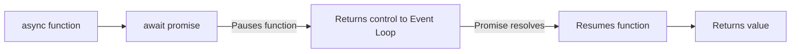

## TL;DR

`async` and `await` are syntactical sugar on top of Promises. They allow you to write asynchronous, non-blocking code that reads like traditional, synchronous code, eliminating `.then()` chaining.

## Mental Model



## How It Works

1.  **`async`**: Placing this keyword before a function guarantees that the function will always return a Promise.
2.  **`await`**: Can only be used inside an `async` function. It pauses the execution of *that specific function* until the Promise settles (resolves or rejects), without blocking the Node.js main thread.

## Example

```javascript
const fs = require('fs').promises; // Use the promise-based version

async function processData() {
    try {
        // Pauses function execution here, but the Event Loop continues!
        const data = await fs.readFile('config.json', 'utf8');
        const parsed = JSON.parse(data);
        console.log('Success:', parsed);
    } catch (err) {
        // Handles both I/O errors and JSON.parse errors
        console.error('Error occurred:', err); 
    }
}

processData();
```

## Common Interview Questions

### Does `await` block the main thread?
No. `await` only pauses the execution of the `async` function it is inside. Under the hood, it yields control back to the Node.js Event Loop, allowing other tasks (like handling HTTP requests) to run while waiting.

### How do you run multiple `await` calls in parallel?
If the calls do not depend on each other, do not use `await` sequentially. Use `Promise.all()` instead.

```javascript
// BAD: Takes 2 seconds
const users = await fetchUsers(); 
const posts = await fetchPosts(); 

// GOOD: Takes 1 second
const [users, posts] = await Promise.all([fetchUsers(), fetchPosts()]);
```
