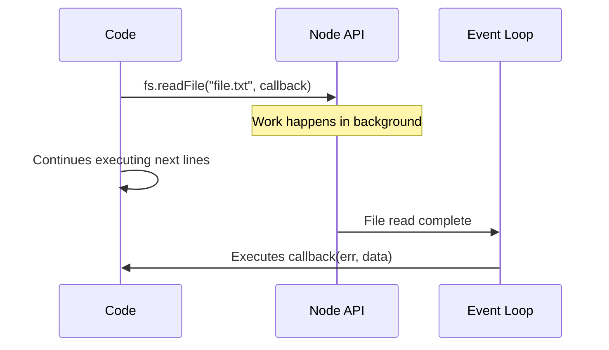

## TL;DR

A **Callback** is a function passed as an argument to another function, which gets executed later when an asynchronous task completes. In Node.js, core modules use an "Error-First" callback pattern.

## Mental Model



## How It Works (Error-First Pattern)

In Node.js, almost all core asynchronous functions accept a callback as their last argument. This callback expects the **first argument to be an Error object** (or `null` if successful), and subsequent arguments to be the successful response data.

## Example

```javascript
const fs = require('fs');

// Error-first callback
fs.readFile('data.json', 'utf8', (err, data) => {
    if (err) {
        console.error('Failed to read file:', err.message);
        return; // Always return early on error
    }
    console.log('File content:', data);
});
```

## Common Interview Questions

### What is "Callback Hell" and how do you fix it?
Callback Hell (or the "Pyramid of Doom") happens when you nest multiple callbacks within each other, making the code hard to read and difficult to handle errors. You fix it by using Promises or `async/await`.

### Why does Node.js use the "Error-First" pattern?
Because asynchronous callbacks execute later, you can't use `try/catch` around the original function call to catch errors. The error must be passed explicitly to the callback so the developer can handle it.
