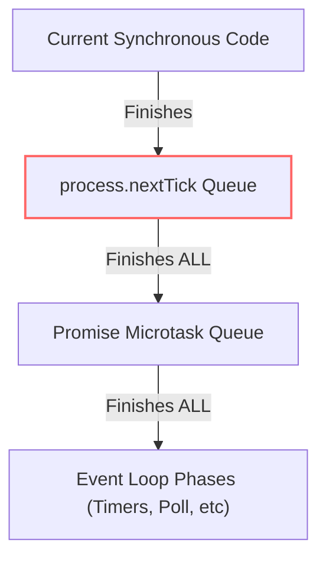

## TL;DR

`process.nextTick()` adds a callback to the **"next tick queue"**. This queue is processed *immediately* after the current operation finishes, **before** the Event Loop moves on to any other phases, and even before Promises (Microtasks) are resolved.

## Mental Model



## How It Works

Callbacks passed to `process.nextTick` are resolved before the Event Loop takes its next step. It is the absolute highest priority asynchronous queue in Node.js.

## Example

```javascript
console.log('1. Start');

setTimeout(() => console.log('4. setTimeout'), 0);

Promise.resolve().then(() => console.log('3. Promise'));

process.nextTick(() => console.log('2. nextTick'));

console.log('Start finished');

/* Output:
1. Start
Start finished
2. nextTick
3. Promise
4. setTimeout
*/
```

## Common Interview Questions

### Can `process.nextTick` starve the Event Loop?
Yes! If you recursively call `process.nextTick()`, Node.js will continually process the next tick queue and will **never** reach the Event Loop phases (like processing I/O or timers). 

```javascript
function starve() {
    process.nextTick(starve); // Blocks the event loop forever
}
```

### When should you use `process.nextTick`?
1. To allow users to initialize event handlers (like `.on('event')`) before an event is emitted.
2. To ensure a callback is always executed asynchronously, even if the data is available synchronously, keeping API behavior consistent.
