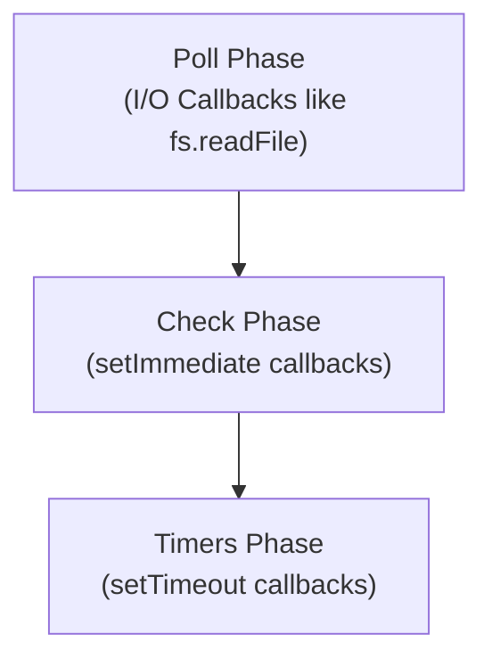

## TL;DR

`setImmediate()` schedules a callback to execute in the **Check phase** of the Event Loop, which runs immediately *after* the Poll phase (I/O callbacks) completes.

## Mental Model



## How It Works

Despite the name, `setImmediate` does not run immediately. It yields to the event loop, allowing I/O operations to process, and then runs during the Check phase. 

It was designed specifically to execute a script once the current Poll phase completes.

## Example

```javascript
const fs = require('fs');

// Outside an I/O cycle, the order of setTimeout and setImmediate is non-deterministic 
// due to process performance.
setTimeout(() => console.log('Timeout'), 0);
setImmediate(() => console.log('Immediate'));

// INSIDE an I/O cycle, setImmediate ALWAYS runs first
fs.readFile(__filename, () => {
  setTimeout(() => console.log('Timeout Inside IO'), 0);
  setImmediate(() => console.log('Immediate Inside IO'));
});

/* Output for I/O:
Immediate Inside IO
Timeout Inside IO
*/
```

## Common Interview Questions

### What is the difference between `setTimeout(fn, 0)` and `setImmediate()`?
- `setTimeout(0)` runs in the **Timers phase**.
- `setImmediate()` runs in the **Check phase**.
If called within an I/O callback (like reading a file), `setImmediate` is guaranteed to execute *before* `setTimeout(0)`, because the Check phase immediately follows the Poll phase.

### `setImmediate` vs `process.nextTick`?
- `process.nextTick` fires *before* the event loop continues, pausing everything.
- `setImmediate` fires on the *next iteration* of the loop (Check phase), allowing other I/O to be processed first.
