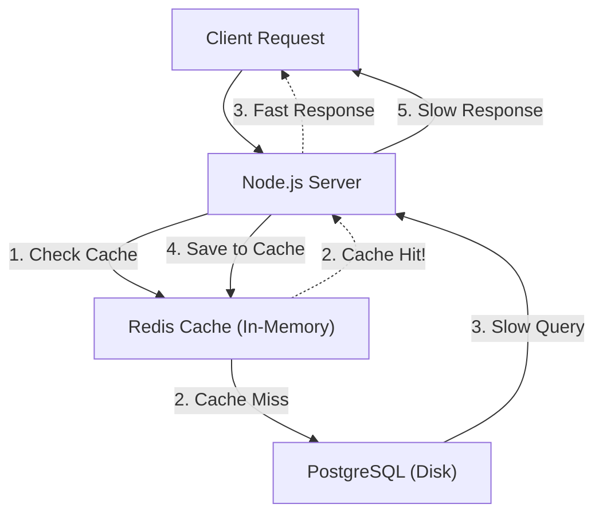

## TL;DR

**Caching** involves storing the results of expensive operations (like heavy database queries or external API calls) in a fast, in-memory store. Subsequent identical requests can be served directly from the cache, bypassing the database and improving latency from hundreds of milliseconds to under a millisecond.

## Mental Model



## How It Works

The most common caching strategy is the **Cache-Aside** pattern:
1. Your application first checks the cache (e.g., Redis).
2. If the data is there (Cache Hit), return it immediately.
3. If the data is missing (Cache Miss), query the real database.
4. Store the result in the cache for next time, usually with a **TTL (Time to Live)** so it automatically expires and doesn't become stale.

## Example

```javascript
const redis = require('redis');
const client = redis.createClient();
await client.connect();

app.get('/user/:id', async (req, res) => {
    const userId = req.params.id;
    const cacheKey = `user:${userId}`;

    // 1. Check Cache
    const cachedData = await client.get(cacheKey);
    if (cachedData) {
        return res.json(JSON.parse(cachedData)); // Cache Hit!
    }

    // 2. Cache Miss: Hit the slow database
    const user = await db.query('SELECT * FROM users WHERE id = ?', [userId]);

    // 3. Save to Cache with a 60-second expiration (TTL)
    await client.set(cacheKey, JSON.stringify(user), { EX: 60 });

    res.json(user);
});
```

## Common Interview Questions

### What happens if you don't use a TTL (Time to Live)?
If you don't set a TTL, the cache will grow infinitely until Redis runs out of memory and crashes. Additionally, if the database data is updated, the cache will forever serve stale, incorrect data (Cache Invalidation problem).

### In-memory (Node variable) vs Distributed Cache (Redis)?
You can cache data in a simple JavaScript `Map` inside your Node.js process. However, if you scale horizontally to 5 Node.js servers, they won't share the `Map`. One server might have the cache, while the other 4 hit the database. A Distributed Cache (Redis) ensures all servers share the same fast memory pool.
