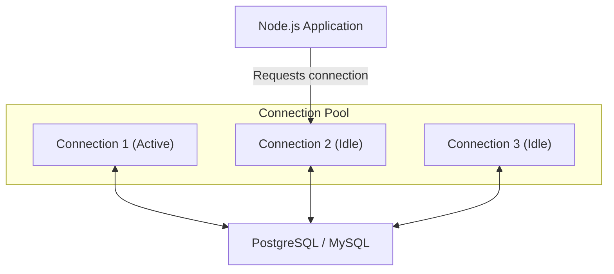

## TL;DR

**Connection Pooling** is a technique where a fixed number of database connections are created upfront and kept open. When the Node.js application needs to query the database, it borrows an existing connection from the pool rather than opening a new one, drastically reducing latency and CPU overhead.

## Mental Model



## How It Works

Opening a new TCP/TLS connection to a database requires a multi-step handshake and authentication, taking tens or hundreds of milliseconds. If you do this for every HTTP request, your database will crash under load, and response times will be terrible.

A connection pool acts as a queue:
1. App asks for a connection.
2. Pool provides an idle one.
3. App runs the query.
4. App releases the connection back to the pool.
If the pool is full and all connections are busy, incoming queries are queued until a connection becomes available.

## Example

```javascript
// Using the popular 'pg' (PostgreSQL) package
const { Pool } = require('pg');

// Initialize the pool ONCE globally
const pool = new Pool({
  user: 'dbuser',
  host: 'database.server.com',
  database: 'mydb',
  password: 'secretpassword',
  port: 5432,
  max: 20, // Max number of connections in the pool
  idleTimeoutMillis: 30000 // Close idle connections after 30s
});

async function getUser(id) {
    // Automatically acquires an idle connection, runs query, and releases it
    const { rows } = await pool.query('SELECT * FROM users WHERE id = $1', [id]);
    return rows[0];
}
```

## Common Interview Questions

### What happens if you set the pool size too high (e.g., 1000)?
It will crash the database. Databases have strict limits on the number of concurrent connections they can handle because each connection consumes RAM on the database server. A smaller pool size (like 10-50) is usually much faster than a large pool because it prevents the database from context-switching between queries.

### What is PgBouncer?
Node.js scales via the `cluster` module or Kubernetes pods. If you have 50 pods, and each has a pool of 20, you suddenly have 1000 connections hitting the DB. **PgBouncer** is a lightweight proxy that sits between your Node apps and the database, pooling connections at a global infrastructure level.
