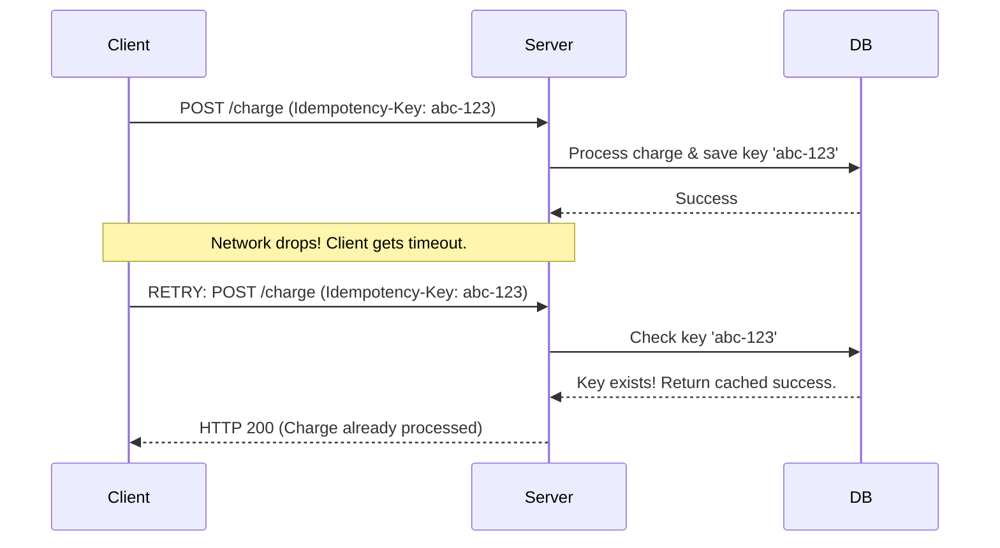

## TL;DR

**Idempotency** is a property of an operation where applying it multiple times has the exact same effect as applying it once. In backend development, building idempotent APIs guarantees that if a client experiences a network timeout and retries a request (like creating a payment), the server won't accidentally charge them twice.

## Mental Model



## How It Works

According to HTTP specifications:
- `GET`, `PUT`, `DELETE` are expected to be naturally idempotent. (Deleting the same user twice still leaves you with a deleted user).
- `POST` is **not** idempotent. Executing it twice usually creates two records.

To make `POST` endpoints idempotent, clients generate a unique UUID (an `Idempotency-Key`) and send it in the headers. The server checks if this key already exists in the database/Redis. If it does, the server skips the operation and simply returns the cached response of the original request.

## Example

```javascript
const express = require('express');
const redis = require('redis');
const app = express();

app.post('/api/checkout', async (req, res) => {
    const idempotencyKey = req.headers['idempotency-key'];
    
    if (!idempotencyKey) return res.status(400).send('Idempotency-Key required');

    // 1. Check if we already processed this exact request
    const cachedResponse = await redisClient.get(`idemp:${idempotencyKey}`);
    if (cachedResponse) {
        // Return the exact same response as the first time
        return res.json(JSON.parse(cachedResponse)); 
    }

    // 2. Perform the actual heavy/mutating logic (e.g., charge credit card)
    const result = await processPayment(req.body);

    // 3. Cache the successful result against the idempotency key for 24 hours
    await redisClient.setEx(`idemp:${idempotencyKey}`, 86400, JSON.stringify(result));

    res.json(result);
});
```

## Common Interview Questions

### What happens if two identical requests arrive at the exact same millisecond?
This is a race condition. Both requests might check Redis, see the key is empty, and both execute the payment logic. To prevent this, your database check must be atomic. In Redis, you can use `SETNX` (Set if Not eXists), or use a database transaction with a unique constraint on the idempotency key to ensure only one thread proceeds.

### Why not just check if the transaction ID exists in the database?
Because the external API you are calling (like Stripe) might generate the transaction ID. If the network drops before you receive the ID, you have no way to know if it succeeded or not. The `Idempotency-Key` is generated by the *client* beforehand, so both parties always know the identifier.
