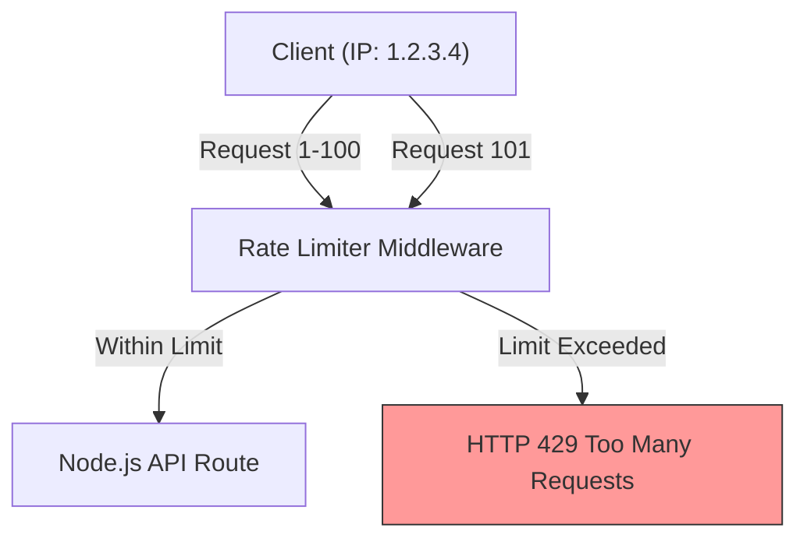

## TL;DR

**Rate Limiting** is a defensive mechanism that controls how many requests a client (identified by IP address or API key) can make to your server within a specific time window. It protects your infrastructure from brute-force attacks, DDoS attacks, and noisy neighbors.

## Mental Model



## How It Works

When a request arrives, the rate limiter records the client's identifier (IP address) in a store (Memory or Redis) along with a counter and a timestamp.
- If the counter is below the limit, the request proceeds, and the counter increments.
- If the counter exceeds the limit, the server immediately returns an **HTTP 429 (Too Many Requests)** status code.

Common algorithms include:
- Fixed Window (Reset counter every minute)
- Sliding Window Log (More accurate, memory heavy)
- Token Bucket (Smooths out bursts)

## Example

```javascript
// Using the popular express-rate-limit package
const express = require('express');
const rateLimit = require('express-rate-limit');

const app = express();

// Create the limiter
const apiLimiter = rateLimit({
	windowMs: 15 * 60 * 1000, // 15 minutes
	max: 100, // Limit each IP to 100 requests per windowMs
	standardHeaders: true, // Return rate limit info in the `RateLimit-*` headers
	legacyHeaders: false, // Disable the `X-RateLimit-*` headers
    message: { error: 'Too many requests, please try again later.' }
});

// Apply the rate limiting middleware to all requests
app.use('/api/', apiLimiter);

app.get('/api/data', (req, res) => res.send('Protected data'));
```

## Common Interview Questions

### Why shouldn't you store rate limit data in memory in production?
Packages like `express-rate-limit` use Node.js RAM by default. If your app is scaled across 5 servers behind a load balancer, each server tracks its own limits independently. A user could hit your API 500 times instead of 100. In production, you must use a centralized store like **Redis** (e.g., `rate-limit-redis`) so all servers share the same counters.

### Should rate limiting be handled by Node.js?
Preferably no. While you *can* do it in Express, it's much more efficient to handle rate limiting at the Edge or API Gateway layer (like Cloudflare, NGINX, or AWS API Gateway). This blocks malicious traffic before it even uses CPU time on your Node.js servers.
