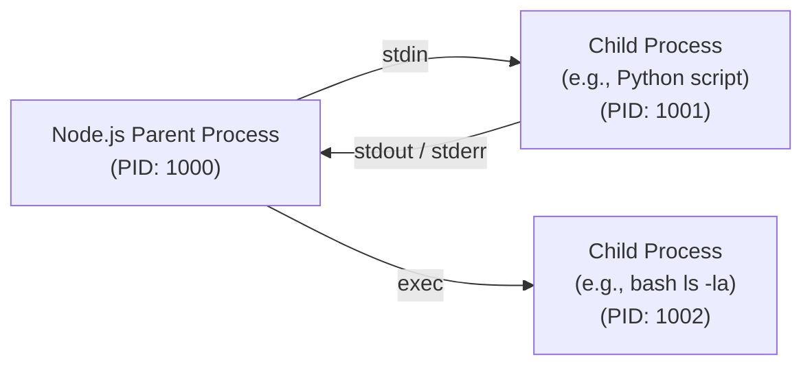

## TL;DR

The `child_process` module allows Node.js to execute external applications, scripts, or shell commands in a separate OS process, communicating with them via standard input/output streams.

## Mental Model



## How It Works

There are four primary ways to spawn a child process:
1.  **`spawn()`**: Starts a process and returns streams (`stdout`, `stdin`). Best for large amounts of data (like processing a video via FFmpeg).
2.  **`exec()`**: Runs a command in a shell and buffers the output in memory. Returns the whole output as a string. Dangerous for large data (buffer overflow).
3.  **`execFile()`**: Like `exec`, but executes a file directly without spinning up a shell, making it slightly faster and safer.
4.  **`fork()`**: A special version of `spawn` designed specifically to spawn *other Node.js processes*. It establishes an IPC (Inter-Process Communication) channel so the parent and child can send messages to each other.

## Example

```javascript
const { spawn, exec } = require('child_process');

// 1. Using exec (Buffers output - good for small scripts)
exec('ls -la', (error, stdout, stderr) => {
    if (error) return console.error(`exec error: ${error}`);
    console.log(`Directory listing:\n${stdout}`);
});

// 2. Using spawn (Streams output - good for large data)
const grep = spawn('grep', ['ssh']);

grep.stdout.on('data', (data) => {
  console.log(`grep output: ${data}`);
});
```

## Common Interview Questions

### What is the difference between `spawn` and `exec`?
`spawn` works with streams, allowing you to process unlimited amounts of data as it arrives. `exec` buffers the output in memory and passes the complete string to a callback when finished, which will crash if the output exceeds the default buffer size (usually 1MB).

### What is IPC (Inter-Process Communication)?
When you use `child_process.fork('script.js')`, Node sets up an IPC channel. This allows the parent and child Node.js processes to communicate directly using `process.send({ data })` and `process.on('message', ...)`.
