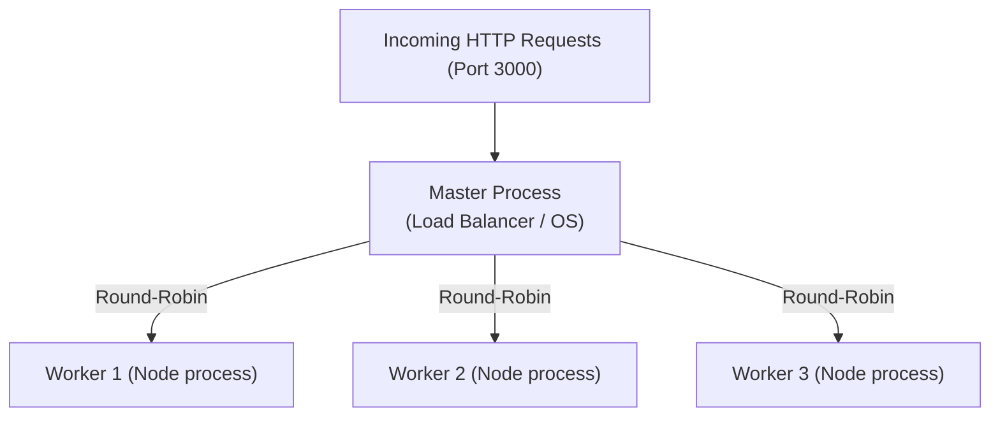

## TL;DR

The `cluster` module allows you to easily create child processes (workers) that run simultaneously and **share the same server port**. This is the built-in way to scale a single-threaded Node.js web server to utilize all available CPU cores.

## Mental Model



## How It Works

1.  A **Master** process is started. Its only job is to manage the workers.
2.  The Master uses `cluster.fork()` to spawn multiple **Worker** processes (usually one per CPU core).
3.  All workers share the same TCP port (e.g., 3000). 
4.  When requests arrive, the Master process distributes them among the workers using a round-robin algorithm.

## Example

```javascript
const cluster = require('cluster');
const http = require('http');
const os = require('os');

const numCPUs = os.cpus().length;

if (cluster.isPrimary) {
  console.log(`Master process ${process.pid} is running`);

  // Fork a worker for each CPU core
  for (let i = 0; i < numCPUs; i++) {
    cluster.fork();
  }

  // Replace dead workers
  cluster.on('exit', (worker, code, signal) => {
    console.log(`Worker ${worker.process.pid} died. Restarting...`);
    cluster.fork();
  });
} else {
  // Workers share the TCP connection in this block
  http.createServer((req, res) => {
    res.writeHead(200);
    res.end(`Hello from Worker ${process.pid}\n`);
  }).listen(8000);

  console.log(`Worker ${process.pid} started`);
}
```

## Common Interview Questions

### Do cluster workers share memory?
**No.** Each worker is a completely separate OS process with its own V8 instance and its own memory. If Worker A updates a local variable, Worker B will not see the change. You must use a database like Redis to share state (like sessions) between workers.

### Should I use the Cluster module in production?
Often, **no**. In modern cloud infrastructure, it is usually better to deploy multiple single-threaded Node.js containers (via Docker/Kubernetes) and let the infrastructure load balancer (like AWS ALB or NGINX) handle the traffic distribution, rather than managing processes manually with the `cluster` module.
