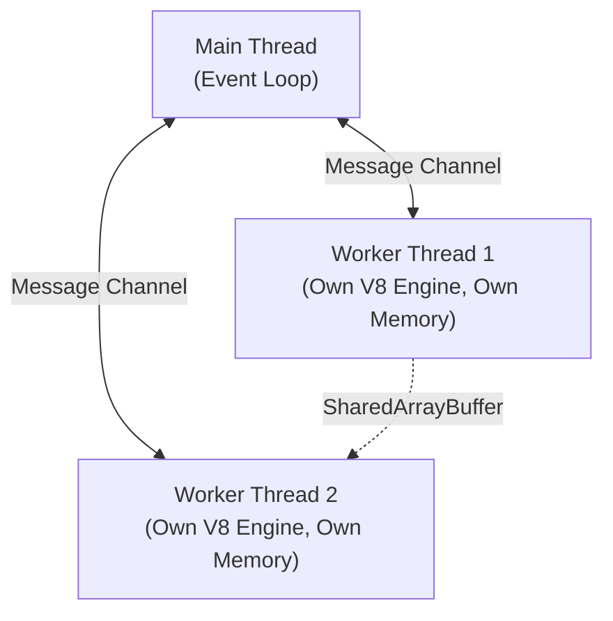

## TL;DR

The `worker_threads` module enables true multithreading in Node.js for executing JavaScript code. Unlike `libuv`'s hidden thread pool (which handles I/O), Worker Threads allow you to offload heavy **CPU-bound** JavaScript tasks (like image processing or complex math) without blocking the main event loop.

## Mental Model



## How It Works

Each Worker Thread gets its own isolate, meaning it has its own V8 engine, its own Event Loop, and its own memory. 
Because memory is isolated, workers communicate with the main thread using **message passing** (`postMessage`) or by using a `SharedArrayBuffer` for raw binary data.

## Example

```javascript
const { Worker, isMainThread, parentPort, workerData } = require('worker_threads');

if (isMainThread) {
  // --- MAIN THREAD ---
  console.log('Main: Spawning worker...');
  const worker = new Worker(__filename, { workerData: { num: 42 } });

  worker.on('message', (result) => console.log(`Main: Worker said ${result}`));
  worker.on('error', (err) => console.error(err));
  
} else {
  // --- WORKER THREAD ---
  const data = workerData.num;
  console.log(`Worker: Received ${data}. Doing heavy math...`);
  
  // CPU-heavy operation here...
  let result = data * 2; 

  // Send result back to main thread
  parentPort.postMessage(result);
}
```

## Common Interview Questions

### Should I use Worker Threads for network/database requests?
**No.** Network and database requests are I/O bound. The built-in async features (Promises, Event Loop) handle I/O much more efficiently than spawning an entirely new V8 engine thread. Only use Worker Threads for CPU-bound JavaScript operations.

### What is the difference between `cluster` and `worker_threads`?
- **Cluster**: Spawns entirely separate Node.js processes, each with its own memory and OS process ID. Used for scaling a web server across CPU cores.
- **Worker Threads**: Spawns threads within the *same* Node.js process. They consume less memory than full processes and can share memory via `SharedArrayBuffer`.
