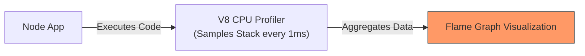

## TL;DR

**CPU Profiling** is the process of tracking which functions your application spends the most time executing. It helps you identify heavy, synchronous algorithms or inefficient regular expressions that are blocking the Node.js event loop.

## Mental Model



## How It Works

When you enable CPU profiling, V8 pauses execution at regular intervals (e.g., every 1 millisecond), looks at the current call stack, and records which function is currently running. 

If it samples a specific function `calculateHash()` 500 times, it knows that function took ~500ms of CPU time. The data is then visualized in a **Flame Graph**, where wide blocks represent functions that took a long time to run.

## Example

```javascript
// Programmatic CPU Profiling
const inspector = require('inspector');
const fs = require('fs');
const session = new inspector.Session();
session.connect();

session.post('Profiler.enable', () => {
  session.post('Profiler.start', () => {
      
    // --- DO HEAVY WORK HERE ---
    let sum = 0;
    for(let i=0; i<10000000; i++) sum += i;
    // --------------------------

    session.post('Profiler.stop', (err, { profile }) => {
      fs.writeFileSync('profile.cpuprofile', JSON.stringify(profile));
      session.disconnect();
      console.log('Profile saved!');
    });
  });
});
```

## Common Interview Questions

### What does a Flame Graph show?
The x-axis does *not* represent time from left to right; it represents the **percentage of total CPU time** spent. The y-axis represents the call stack. A wide block at the top of the stack means a specific function is hogging the CPU directly.

### What is the overhead of CPU profiling?
CPU profiling adds noticeable overhead (sometimes slowing the app down by 10-20%) because it constantly interrupts V8 to take samples. Therefore, it should only be turned on briefly during specific load tests, not left on permanently in production.
