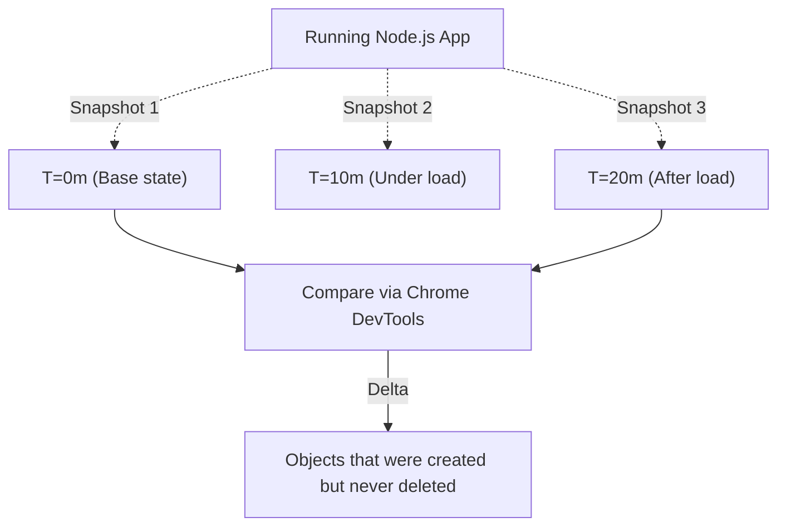

## TL;DR

A **Heap Snapshot** is a static snapshot of the memory currently held in the V8 heap. By taking multiple snapshots over time and comparing them, you can identify which objects are growing continuously and causing memory leaks.

## Mental Model



## How It Works

To find a memory leak, the standard approach is the **Three Snapshot Technique**:
1. Take Snapshot 1 (Baseline).
2. Apply load to your server (simulate user traffic).
3. Take Snapshot 2.
4. Stop the load, wait a few seconds (allow Garbage Collection).
5. Take Snapshot 3.

You then compare Snapshot 3 against Snapshot 1. Any objects that exist in 3 but didn't exist in 1 are "leaked" (they survived the garbage collection when they shouldn't have).

## Example

```javascript
// You can programmatically take a heap snapshot in Node.js
const v8 = require('v8');
const fs = require('fs');

function takeSnapshot() {
    // Generates a file like: Node-Heap-123456.heapsnapshot
    const stream = v8.getHeapSnapshot();
    const fileName = `${Date.now()}.heapsnapshot`;
    stream.pipe(fs.createWriteStream(fileName));
    console.log(`Snapshot saved to ${fileName}`);
}

// Trigger this via an internal admin endpoint or signal
process.on('SIGUSR2', takeSnapshot); 

// Note: You must open the resulting .heapsnapshot file in Chrome DevTools (Memory Tab) to view it.
```

## Common Interview Questions

### What is the difference between "Shallow Size" and "Retained Size"?
- **Shallow Size**: The memory held by the object itself (usually small, just primitive values and pointers).
- **Retained Size**: The total memory that would be freed if this object was deleted. It includes the shallow size plus the size of all the child objects it points to that have no other references. Look for large Retained Sizes when hunting leaks.
