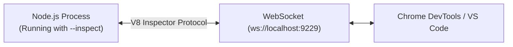

## TL;DR

Node.js comes with a built-in out-of-process debugging utility accessible via a V8 Inspector protocol. By running node with the `--inspect` flag, you can pause execution, set breakpoints, and inspect variables using Chrome DevTools or VS Code.

## Mental Model



## How It Works

When you run `node --inspect app.js`, Node.js opens a WebSocket server on port 9229. A debugging client (like Chrome or VS Code) connects to this port. 

You can place `debugger;` statements in your code. When V8 hits one of these statements (and a client is connected), the entire JavaScript thread pauses, allowing you to manually step through the code line-by-line.

## Example

```javascript
// app.js
function calculateTotal(price, tax) {
    const total = price + (price * tax);
    
    // The code will pause executing right here!
    debugger; 
    
    return total;
}

calculateTotal(100, 0.2);

/*
Usage:
1. Run: node --inspect-brk app.js 
   (--inspect-brk pauses the code on the very first line of the file)
2. Open Chrome, go to: chrome://inspect
3. Click "Open dedicated DevTools for Node"
4. You can now step over the code and see variable values.
*/
```

## Common Interview Questions

### Should you use `console.log` or a Debugger?
While `console.log` is quick for simple scripts, it is terrible for complex objects or tracking execution flow across multiple async functions. The debugger allows you to view the entire call stack, inspect massive objects without truncation, and change variable values at runtime without restarting the server.

### Is it safe to leave `--inspect` on in production?
**No!** Never expose the inspector port to the public internet. Anyone who can connect to the V8 inspector port has complete Remote Code Execution (RCE) access to your server.
