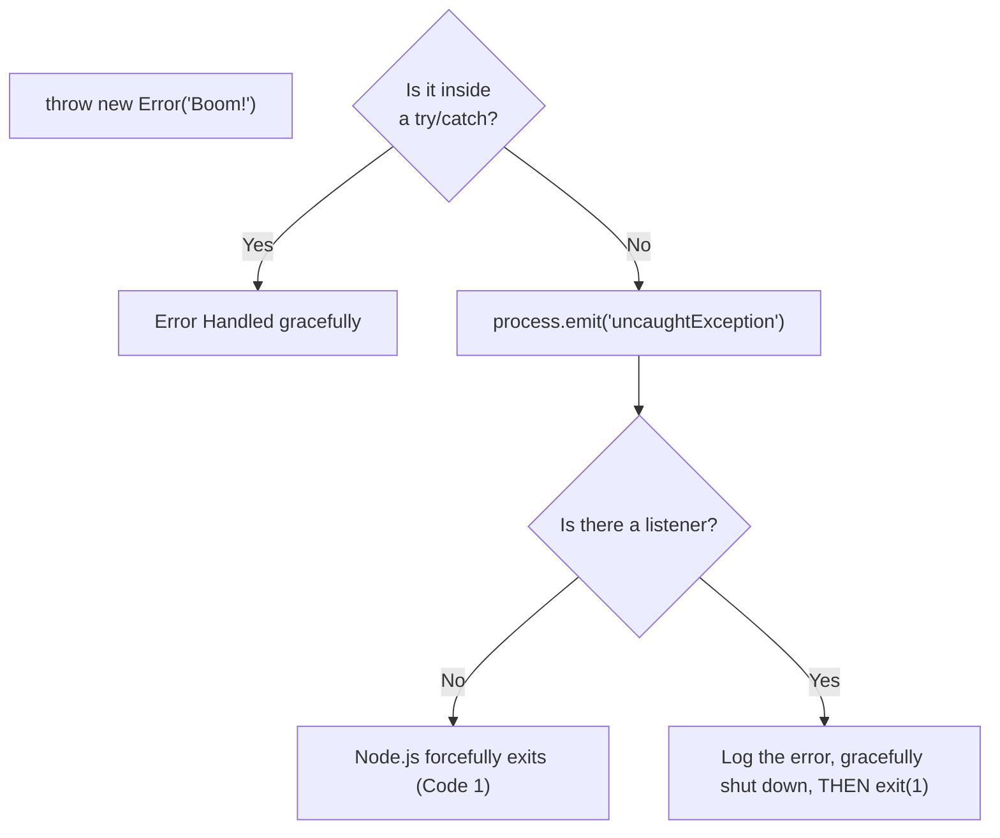

## TL;DR

An `uncaughtException` occurs when a synchronous JavaScript error is thrown but is not caught by any `try...catch` block. By default, Node.js will print the stack trace to `stderr` and immediately crash the process with exit code 1.

## Mental Model



## How It Works

You can listen for this global event to perform last-minute synchronous cleanup or logging before the application dies.

**Crucial Rule**: You *must* exit the process after an `uncaughtException`. The Node.js application is now in an undefined state (memory could be corrupted, event loop blocked). Do not try to keep the server running!

## Example

```javascript
process.on('uncaughtException', (err) => {
    console.error('UNCAUGHT EXCEPTION! Shutting down...');
    console.error(err.name, err.message);
    
    // Do NOT leave the server running. 
    // Synchronously exit. (A tool like PM2 will restart it).
    process.exit(1); 
});

// This will trigger the event above
console.log(undefinedVariable);
```

## Common Interview Questions

### Why is it bad practice to resume execution after an `uncaughtException`?
If an exception reaches the global level, it means an operation was interrupted in the middle of executing. Variables might be left in an inconsistent state, database connections might be hung, and memory might leak. Resuming execution can lead to unpredictable, silent failures or massive data corruption.

### Does `uncaughtException` catch Promise rejections?
No. `uncaughtException` only catches synchronous errors. Asynchronous Promise errors trigger a different global event called `unhandledRejection`.
