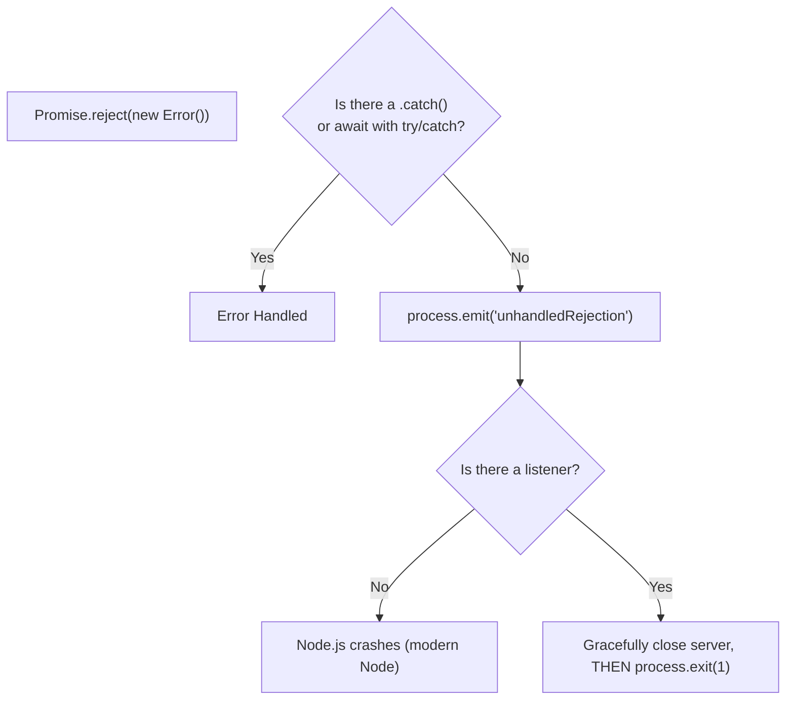

## TL;DR

An `unhandledRejection` event is emitted whenever a Promise is rejected and no error handler (`.catch()` or `try...catch`) is attached to it within the same turn of the event loop.

## Mental Model



## How It Works

Historically, Node.js would only print a deprecation warning for unhandled rejections. As of **Node 15+**, the default behavior is to **crash the application** (throw an `uncaughtException`), ensuring developers do not silently swallow async errors.

## Example

```javascript
const server = app.listen(3000);

process.on('unhandledRejection', (err) => {
    console.error('UNHANDLED REJECTION! Shutting down...');
    console.error(err.name, err.message);
    
    // Graceful shutdown: Close server, then exit
    server.close(() => {
        process.exit(1);
    });
});

// This will trigger the event because there is no .catch()
Promise.reject(new Error('Database connection failed!'));
```

## Common Interview Questions

### How does `unhandledRejection` differ from `uncaughtException`?
- `uncaughtException`: Triggered by synchronous errors. The process is in a critical, unknown state and must be exited *synchronously* and immediately.
- `unhandledRejection`: Triggered by asynchronous Promises. Because it is asynchronous, you usually have time to perform a *graceful shutdown* (finish pending HTTP requests, close DB connections) before calling `process.exit(1)`.

### How can you prevent `unhandledRejection` in Express routes?
By making sure every `async` route handler is wrapped in a `try...catch` block, or by using a package like `express-async-errors` which automatically passes rejected promises to your Express error-handling middleware.
