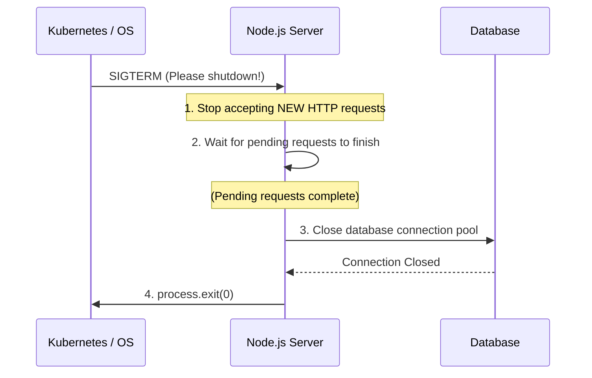

## TL;DR

A **Graceful Shutdown** ensures that when your Node.js application receives a signal to terminate (like during a deployment or pod termination in Kubernetes), it stops accepting new requests, finishes processing the current ongoing requests, closes database connections cleanly, and *then* exits.

## Mental Model



## How It Works

When an OS wants to shut down a process, it sends signals like `SIGTERM` (terminate) or `SIGINT` (interrupt/Ctrl+C). 
If you don't listen for these events, Node.js will forcefully terminate immediately, dropping any users who are halfway through an HTTP request or a database transaction.

## Example

```javascript
const http = require('http');
const server = http.createServer((req, res) => res.end('Hello'));

server.listen(3000);

// Listen for termination signals
['SIGINT', 'SIGTERM'].forEach(signal => {
  process.on(signal, () => {
    console.log(`\nReceived ${signal}. Starting graceful shutdown...`);

    // 1. Stop accepting new connections, wait for existing to finish
    server.close(() => {
      console.log('HTTP server closed.');
      
      // 2. Close database connections (pseudo-code)
      // mongoose.connection.close(() => {
      //   console.log('Database connection closed.');
         
         // 3. Exit safely
         process.exit(0);
      // });
    });

    // Failsafe: forcefully shut down after 10 seconds if hanging
    setTimeout(() => {
        console.error('Forcing shutdown after 10s timeout.');
        process.exit(1);
    }, 10000).unref();
  });
});
```

## Common Interview Questions

### Why is the 10-second timeout failsafe necessary?
Sometimes an active connection is "hung" (e.g., a client with a very slow network downloading a massive file, or a WebSocket connection). `server.close()` will wait forever for them to finish. The failsafe ensures the server doesn't stay in a zombie state indefinitely during deployments.

### What is the difference between `SIGTERM` and `SIGKILL`?
- `SIGTERM`: A polite request to terminate. Your application can intercept it and run cleanup code.
- `SIGKILL` (Code 9): The OS forcefully and instantly murders your process. Your application cannot intercept this.
