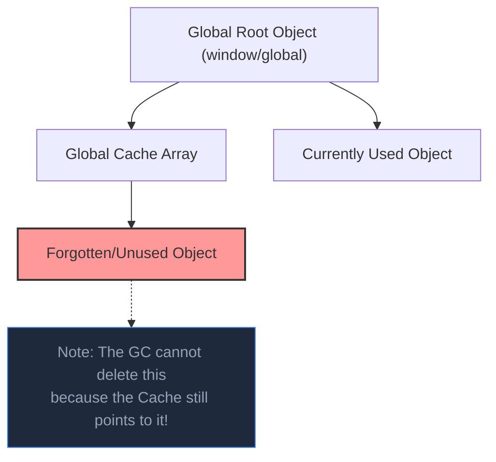

## TL;DR

A **Memory Leak** occurs when an application keeps references to objects that are no longer needed. Because the objects are still "reachable" from the root, the Garbage Collector cannot free them, causing the application's memory usage to grow continuously until it crashes (OOM).

## Mental Model



## How It Works (Common Causes)

1.  **Global Variables / Caches**: Storing data in global arrays/objects (like an in-memory cache) without setting a limit or an eviction policy (TTL).
2.  **Closures**: If a closure captures a large object and the closure itself is kept alive indefinitely.
3.  **Event Listeners**: Attaching `.on('event', callback)` but forgetting to call `.removeListener()`. The `EventEmitter` keeps a reference to the callback, and the callback keeps references to variables in its scope.
4.  **Unfinished Promises**: A Promise that never resolves or rejects can keep its `.then()` closure context alive forever.

## Example

```javascript
const events = require('events');
const myEmitter = new events.EventEmitter();

function handleRequest(req, res) {
    const hugePayload = new Array(1000000).fill('data');

    // MEMORY LEAK! 
    // A new listener is added on EVERY request, but never removed.
    // 'hugePayload' remains referenced by the closure inside the listener.
    myEmitter.on('update', () => {
        console.log(hugePayload[0]);
    });

    res.send('Done');
}
```

## Common Interview Questions

### How do you fix a cache-related memory leak?
Never use a plain object `{}` or `[]` for an unbounded cache in a long-running Node process. Instead, use an external cache like **Redis**, or use an LRU (Least Recently Used) cache library that automatically deletes old keys to keep memory usage strictly capped.

### What happens if you forget to remove an Event Listener?
Node.js has a built-in safeguard: if you add more than 10 listeners for a single event, it prints a `MaxListenersExceededWarning` to the console. This is a massive hint that you have a memory leak!
