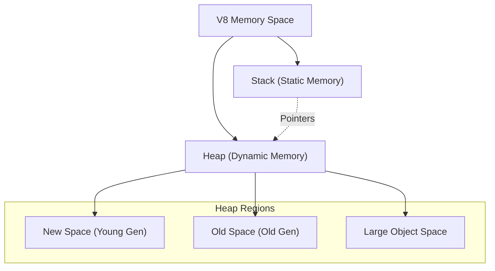

## TL;DR

Memory in Node.js is managed by the V8 JavaScript engine. It is divided into two primary regions: the **Stack** (for static data and function execution context) and the **Heap** (for dynamic objects and arrays). V8 automatically allocates and frees memory using Garbage Collection.

## Mental Model



## How It Works

1.  **Stack**: A LIFO (Last-In-First-Out) data structure that stores primitive types (`Number`, `String`, `Boolean`) and object references (pointers). It is very fast and managed automatically as functions are called and return.
2.  **Heap**: A large unstructured region of memory where reference types (Objects, Arrays, Functions) are stored. 
3.  **Resident Set Size (RSS)**: The total memory allocated for the Node process execution, which includes the V8 Heap, the V8 Stack, and C++ bindings/buffers.

## Example

```javascript
function allocateMemory() {
    // 'id' is a primitive. It is stored on the Stack.
    const id = 123; 

    // 'user' is an object. The object itself is stored in the Heap.
    // The variable 'user' (the pointer/reference) is stored on the Stack.
    const user = { name: "Alice", age: 30 }; 
}

allocateMemory();
// After the function returns, the Stack memory (id, user pointer) is cleared immediately.
// The object { name: "Alice", ... } remains in the Heap until Garbage Collected.
```

## Common Interview Questions

### What is the default memory limit in Node.js?
By default, the V8 heap limit is roughly **1.4 GB on 64-bit systems** (and 700 MB on 32-bit). If your application exceeds this, it will crash with an `Out of Memory (OOM)` error.

### How can you increase the Node.js memory limit?
You can increase the limit by passing the `--max-old-space-size` flag when starting Node.js.
`node --max-old-space-size=4096 index.js` (Sets the limit to 4GB).
