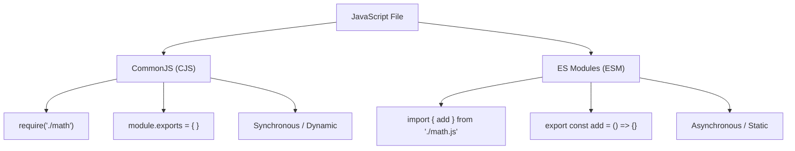

## TL;DR

- **CommonJS (CJS)**: The original Node.js module system. Uses `require()` and `module.exports`. Modules are loaded **synchronously**.
- **ECMAScript Modules (ESM)**: The modern JavaScript standard. Uses `import` and `export`. Modules are loaded **asynchronously** and statically analyzed.

## Mental Model



## Example

### CommonJS (Legacy)
```javascript
// math.js
function add(a, b) { return a + b; }
module.exports = { add };

// index.js
const math = require('./math'); // Synchronous
console.log(math.add(1, 2));
```

### ES Modules (Modern)
```javascript
// math.js
export function add(a, b) { return a + b; }

// index.js
import { add } from './math.js'; // Asynchronous (Static)
console.log(add(1, 2));
```

## How It Works

1. **Static Analysis**: Because `import` statements must be at the top level (they cannot be inside `if` blocks), bundlers like Webpack or Vite can statically analyze the code and perform **Tree Shaking** (removing unused exports). `require()` can be dynamic, making tree shaking impossible.
2. **Top-level Await**: ESM allows you to use the `await` keyword at the top level of a module outside of an async function. CommonJS does not.
3. **Globals**: In CommonJS, `__dirname` and `__filename` are globally available. In ESM, they do not exist (you must use `import.meta.url` to calculate them).

## Interview Questions

### How do you tell Node.js to use ESM?
1. Use the `.mjs` file extension.
2. OR, add `"type": "module"` to your `package.json`.

### Can you use `require` inside an ES Module?
No. `require` is not defined in ESM. If you absolutely must load a CJS module dynamically in ESM, you can use the async `import()` function or use the built-in `module.createRequire` utility.

## Common Gotchas

*   **File Extensions**: In ESM within Node.js, you *must* include the file extension in your relative imports (e.g., `import './utils.js'`), whereas CommonJS allows you to omit it (`require('./utils')`).

## Remember

> CommonJS is the past. ES Modules are the present and future. New Node.js projects should default to `"type": "module"`.
