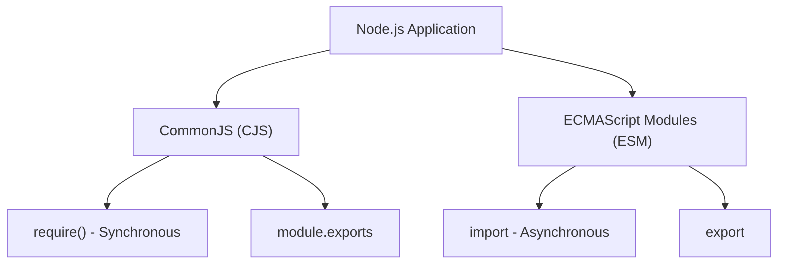

## TL;DR

Node.js traditionally used **CommonJS** (`require()`, `module.exports`), which is synchronous. Modern Node.js also supports **ECMAScript Modules (ESM)** (`import`, `export`), which is asynchronous, standard in browsers, and supports Top-Level Await.

## Mental Model



## How It Works

### CommonJS
*   Loads modules **synchronously** at runtime.
*   Files are wrapped in an IIFE (Immediately Invoked Function Expression) before execution, providing them with `__dirname`, `__filename`, `require`, and `module`.
*   Uses `require()` to load and `module.exports` to export.

### ECMAScript Modules (ESM)
*   Loads and parses modules **asynchronously** before executing the code (parsing phase vs execution phase).
*   Does *not* have `__dirname`, `__filename`, or `require` built-in (you must use `import.meta.url`).
*   Supports **Top-Level Await** (using `await` outside of an async function).

## Example

```javascript
// --- CommonJS ---
const fs = require('fs');
module.exports = function doSomething() { /* ... */ };

// --- ESM ---
// (Requires "type": "module" in package.json OR .mjs extension)
import fs from 'fs';
export function doSomething() { /* ... */ };

// Top-level await is valid in ESM!
const data = await fs.promises.readFile('config.json');
```

## Common Interview Questions

### Can you use `require()` inside an ESM file?
By default, no. `require` is not defined in an ES module. If you need to import a CommonJS module into an ESM file, you can just `import` it, or you can construct `require` using `module.createRequire(import.meta.url)`.

### How does Node.js know if a file is CJS or ESM?
Node.js treats `.cjs` files as CommonJS and `.mjs` files as ESM. For `.js` files, it checks the nearest `package.json` for the `"type"` field. If `"type": "module"`, it treats `.js` as ESM. If `"type": "commonjs"` (or missing), it defaults to CommonJS.
