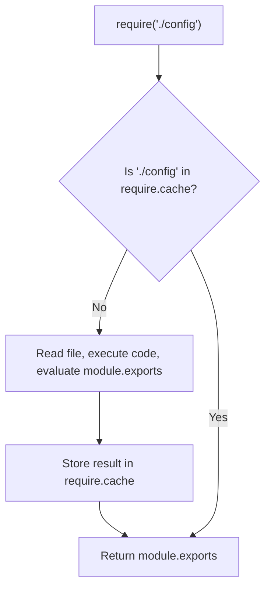

## TL;DR

When a module is loaded via `require()`, Node.js caches it in memory. Subsequent calls to `require()` for the exact same file will return the **cached object**, rather than executing the file's code again. This improves performance and allows modules to act as singletons to share state.

## Mental Model



## How It Works

Node.js stores cached modules in the `require.cache` object. The keys in this object are the absolute file paths of the modules.

Because of this caching:
1.  Code inside a module is only executed **once**, no matter how many times it is required across your application.
2.  If you export an object or instance, it behaves like a **Singleton**. All files requiring it will share the exact same reference.

## Example

```javascript
// counter.js
let count = 0;
module.exports = {
    increment: () => count++,
    getCount: () => count
};

// fileA.js
const counter = require('./counter');
counter.increment();

// fileB.js
const counter = require('./counter');
console.log(counter.getCount()); // Output: 1!
// Because of module caching, fileB gets the exact same object modified by fileA.
```

## Common Interview Questions

### Can you invalidate or clear the module cache?
Yes. You can delete the specific entry from the `require.cache` object using its absolute path.
```javascript
delete require.cache[require.resolve('./my-module')];
// Next require('./my-module') will execute the file again.
```

### Is module caching based on the file name or the requested path?
It is based on the **resolved absolute filename**. Even if you require a module using different relative paths from different files (e.g., `require('../util')` vs `require('./util')`), they resolve to the same absolute path, so they hit the same cache.
