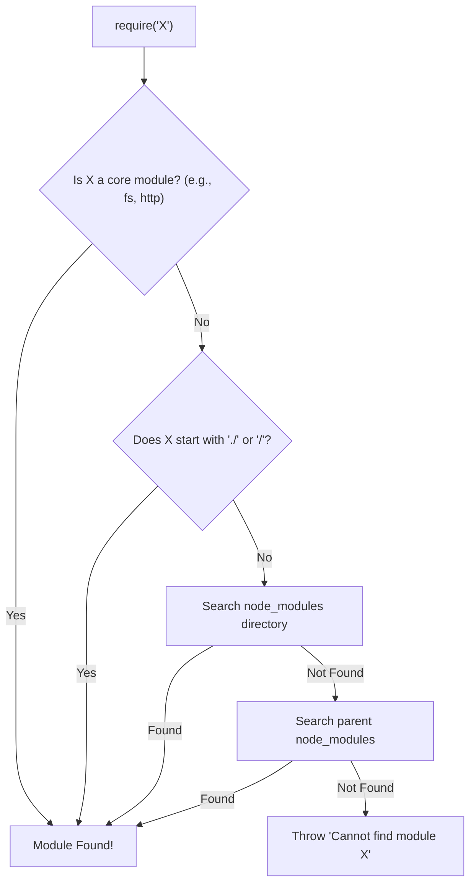

## TL;DR

**Module Resolution** is the algorithm Node.js uses to figure out the exact file path to load when you use `require('something')` or `import 'something'`. It looks for core modules first, then local files, then searches up the directory tree in `node_modules` folders.

## Mental Model



## How It Works

1.  **Core Modules**: If the identifier matches a core module (`fs`, `path`, `http`), it loads that immediately.
2.  **File Modules**: If the identifier begins with `/`, `./`, or `../`, Node.js resolves it as an absolute or relative file path. It tries the exact name, then `.js`, `.json`, and `.node` extensions, and then looks for an `index.js` inside a folder.
3.  **node_modules**: If it's not a core module and doesn't start with a path indicator, Node.js starts in the current directory, looks in `./node_modules`, and if not found, moves to the parent directory `../node_modules`, continuing all the way to the root of the file system.

## Example

```javascript
// 1. Core Module
const http = require('http'); 

// 2. File Module
const myUtil = require('./utils/math'); // Looks for math.js, then math/index.js

// 3. node_modules
const express = require('express'); 
// Looks in:
// /project/src/node_modules/express
// /project/node_modules/express
// /node_modules/express
```

## Common Interview Questions

### What happens if two dependencies require different versions of the same library?
Because of the way Node.js resolves modules by looking up the directory tree, NPM installs the conflicting version of the library *inside* the `node_modules` of the specific dependency that requires it. This allows multiple versions of the same library to coexist perfectly in the same app.

### How does ESM resolution differ from CommonJS?
In ESM (`import`), file extensions are strictly required for relative imports (e.g., `import './math.js'`). It will not magically look for `.js` or `index.js` like CommonJS does, unless configured otherwise via experimental flags or bundlers.
