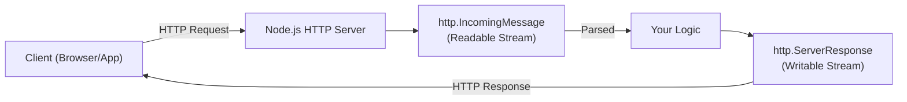

## TL;DR

The built-in `http` module allows Node.js to transfer data over the Hyper Text Transfer Protocol. It provides the foundation for creating web servers and making outbound requests without needing external libraries like Express or Axios.

## Mental Model



## How It Works

The `http` module is built on top of Node's `net` (TCP) module.
*   `http.createServer()` creates a server instance.
*   For every incoming connection, the server emits a `'request'` event, passing an `IncomingMessage` (Request) and a `ServerResponse` (Response).
*   Both the Request and Response objects are **Streams**. You read data from the request in chunks, and write data to the response in chunks.

## Example

```javascript
const http = require('http');

const server = http.createServer((req, res) => {
    // Basic routing
    if (req.url === '/' && req.method === 'GET') {
        res.writeHead(200, { 'Content-Type': 'application/json' });
        res.end(JSON.stringify({ message: 'Hello World!' }));
    } else {
        res.writeHead(404, { 'Content-Type': 'text/plain' });
        res.end('Not Found');
    }
});

server.listen(3000, () => console.log('Server running on port 3000'));
```

## Common Interview Questions

### If we have Express, why do we need to know the `http` module?
Express is a framework built *on top of* the `http` module. Under the hood, Express's `app` is just a giant callback function passed to `http.createServer(app)`. Understanding `http` helps you understand how Express handles streams, headers, and chunked encoding.

### How do you read the body of a POST request using only the `http` module?
Because the request is a Readable stream, you must listen to the `'data'` and `'end'` events to collect the chunks into an array, concatenate them, and parse the resulting string.
