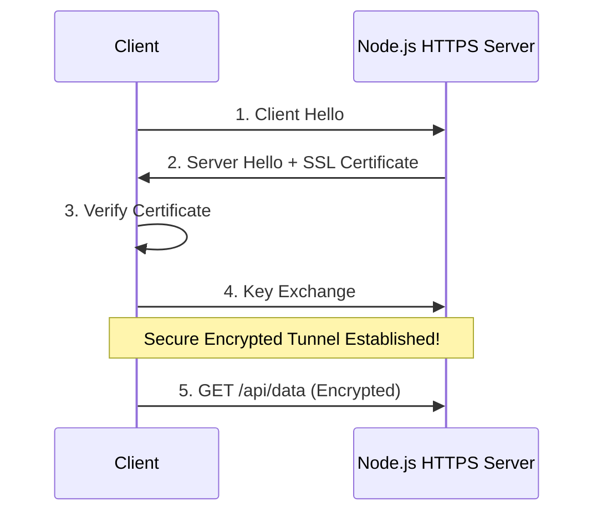

## TL;DR

The `https` module in Node.js works exactly like the `http` module, but establishes communication over a secure **TLS/SSL** (Transport Layer Security) connection, ensuring that data transmitted is encrypted.

## Mental Model



## How It Works

To create an HTTPS server, you must provide a **private key** and a **public certificate** (usually obtained from a Certificate Authority like Let's Encrypt). The underlying protocol is handled by Node's `tls` module, wrapping the TCP connection in cryptographic layers before HTTP data is sent.

## Example

```javascript
const https = require('https');
const fs = require('fs');

// Read the SSL certificate and private key
const options = {
  key: fs.readFileSync('private-key.pem'),
  cert: fs.readFileSync('public-cert.pem')
};

// Create the HTTPS server
const server = https.createServer(options, (req, res) => {
  res.writeHead(200);
  res.end('Secure Hello World!');
});

server.listen(443, () => console.log('Secure server on port 443'));
```

## Common Interview Questions

### Should you terminate SSL/TLS in Node.js directly?
In production, **no**. It is usually considered a best practice to put a reverse proxy (like NGINX, HAProxy, or AWS ALB) in front of Node.js to handle TLS termination. TLS decryption is CPU-intensive, and offloading it frees up the single-threaded Node.js event loop to process actual business logic.

### How do you make an HTTPS request ignoring invalid certificates?
While dangerous in production, for local development you can set `rejectUnauthorized: false` in the request options, or run node with the `NODE_TLS_REJECT_UNAUTHORIZED=0` environment variable.
