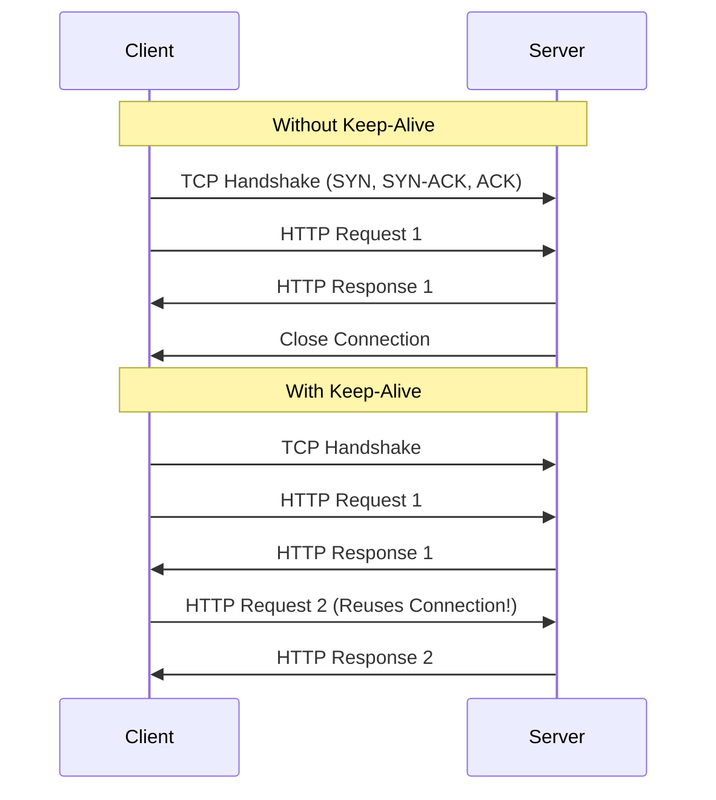

## TL;DR

**Keep-Alive** is an HTTP feature that allows a single TCP connection to remain open for multiple HTTP requests/responses, drastically reducing the latency and CPU overhead caused by repeatedly performing the TCP/TLS handshake.

## Mental Model



## How It Works

By default, the built-in Node.js `http.globalAgent` (which `http.request` uses) does **not** have Keep-Alive enabled. This means every outgoing request from your Node.js backend to another API establishes a brand new TCP connection.

To enable it, you instantiate a new `http.Agent` with `keepAlive: true` and pass it to your requests (or configure libraries like Axios/Fetch to use it).

## Example

```javascript
const http = require('http');

// Create a custom agent with Keep-Alive enabled
const keepAliveAgent = new http.Agent({
    keepAlive: true,
    maxSockets: 100,      // Max concurrent sockets per host
    keepAliveMsecs: 1000  // How long to wait before closing idle sockets
});

// Use the agent in a request
const options = {
    hostname: 'api.example.com',
    port: 80,
    path: '/data',
    agent: keepAliveAgent // Attach the agent here!
};

http.request(options, (res) => {
    // ... handle response
}).end();
```

## Common Interview Questions

### Why is Keep-Alive critical for microservices?
Microservices make thousands of internal requests to each other. If Keep-Alive is disabled, the servers spend a massive amount of CPU and time just opening and closing TCP and TLS connections (which involves expensive cryptographic handshakes).

### Does Node.js Express server enable Keep-Alive by default?
For *incoming* requests from clients, Node.js HTTP servers (and thus Express) automatically respect the `Connection: keep-alive` header sent by browsers and keep the connection open by default (usually with a 5-second timeout).
