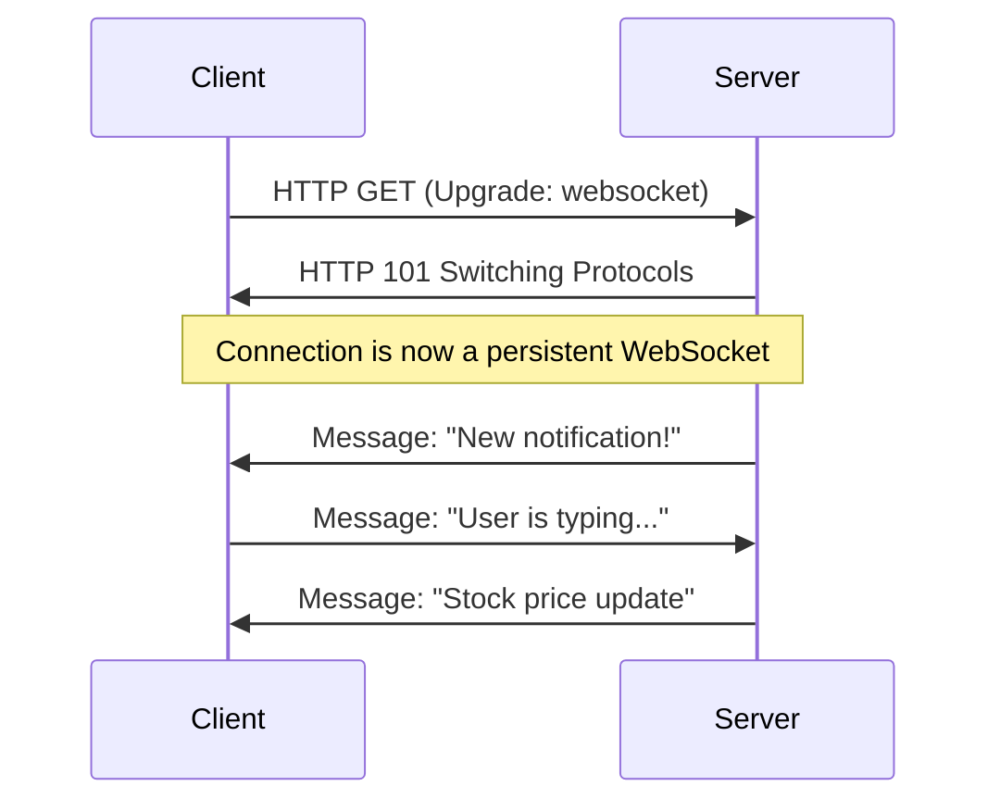

## TL;DR

**WebSockets** provide a way to open an interactive, two-way communication session between a user's browser and a server. Unlike HTTP, where the client must request data, WebSockets allow the server to push real-time updates to the client.

## Mental Model



## How It Works

1.  **The Handshake**: The connection starts as a standard HTTP GET request with specific headers (`Upgrade: websocket`).
2.  **The Upgrade**: If the server supports WebSockets, it responds with an HTTP `101 Switching Protocols` status.
3.  **The Connection**: The original TCP connection is kept alive indefinitely. Both parties can send lightweight "frames" of data back and forth without the heavy overhead of HTTP headers.

*Node.js does not have a built-in WebSocket module. You must use popular libraries like `ws` or `socket.io`.*

## Example (using `ws` library)

```javascript
// npm install ws
const { WebSocketServer } = require('ws');

const wss = new WebSocketServer({ port: 8080 });

wss.on('connection', (ws) => {
  console.log('New client connected!');

  // Listen for messages from this client
  ws.on('message', (data) => {
    console.log('Received: %s', data);
    
    // Echo it back
    ws.send(`Server received: ${data}`);
  });

  // Push a message to the client independently
  ws.send('Welcome to the WebSocket server');
});
```

## Common Interview Questions

### WebSockets vs Server-Sent Events (SSE)?
- **WebSockets** are bi-directional (full-duplex). Ideal for chat apps or multiplayer games.
- **Server-Sent Events (SSE)** are uni-directional (server to client only), operating over standard HTTP. Ideal for live news feeds or simple real-time dashboards where the client doesn't need to send rapid data back.

### What is Socket.io and why use it over raw WebSockets (`ws`)?
`Socket.io` is a library that wraps WebSockets. It provides automatic reconnections, broadcasting to "rooms", and fallback polling to standard HTTP if the network blocks WebSockets. Raw `ws` provides none of these but is faster and lighter.
