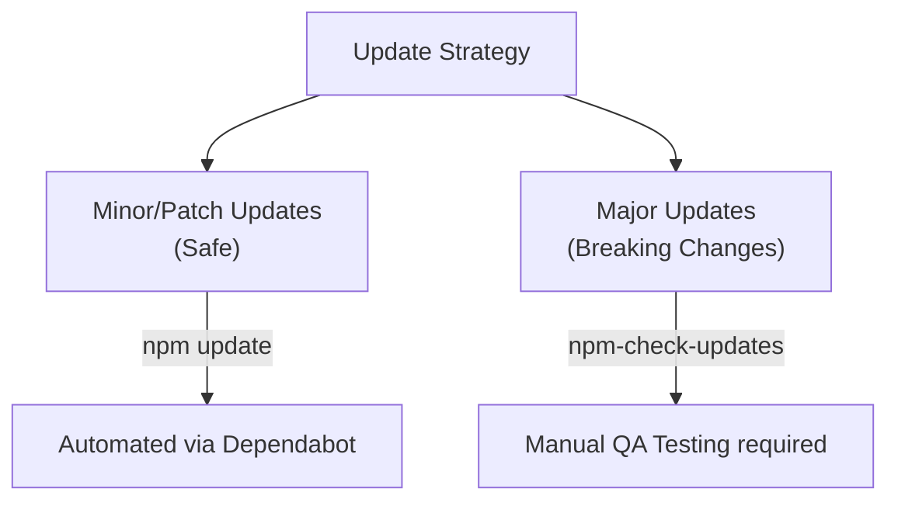

## TL;DR

Effective **Dependency Management** involves not just installing packages, but safely updating them, removing unused ones, and dealing with transitive dependency conflicts to keep the application secure and lightweight.

## Mental Model



## How It Works

Because Node.js projects rely on hundreds of dependencies, managing them manually is prone to errors.
*   **Checking for updates**: Use `npm outdated` to see which packages have newer versions.
*   **Safe Updates**: Running `npm update` only updates packages according to the SemVer ranges defined in your `package.json` (e.g., it updates `^1.2.0` to `1.3.0`, but not to `2.0.0`).
*   **Major Updates**: To upgrade to new major versions, you usually use a community tool like `npm-check-updates` (ncu) which forces the `package.json` to bump to the latest major versions, after which you run `npm install`.

## Example

```bash
# 1. See what packages are out of date
npm outdated

# 2. Update packages to their safe (minor/patch) versions
npm update

# 3. Find and remove unused dependencies from the project
npx depcheck

# 4. View why a specific package was installed (transitive dependency tree)
npm ls lodash
```

## Common Interview Questions

### What does `npm prune` do?
`npm prune` removes "extraneous" packages from your `node_modules` folder. These are packages that are physically present in the folder but are no longer listed in your `package.json` (for example, if you manually deleted a line from `package.json`).

### How do you force a specific version of a transitive dependency?
If `PackageA` depends on a vulnerable version of `PackageB` (e.g., `lodash@3.0.0`), and you can't update `PackageA`, you can use the `"overrides"` field (NPM v8+) or `"resolutions"` field (Yarn) in your `package.json` to force the entire dependency tree to use a patched version of `lodash`.
