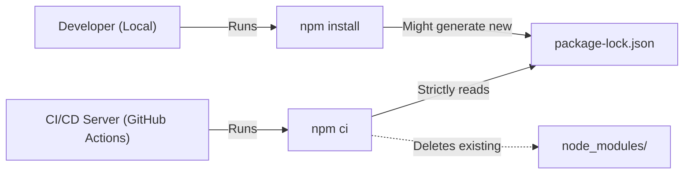

## TL;DR

`npm install` is meant for local development; it can silently modify your `package-lock.json` if dependencies have released safe updates. `npm ci` (Clean Install) is meant for automated environments (CI/CD pipelines); it strictly reads from the lockfile, guarantees an exact match, and fails if the lockfile and `package.json` are out of sync.

## Mental Model



## How It Works

### `npm install`
1. Looks at `package.json`.
2. Looks at `package-lock.json`.
3. If a dependency in `package.json` has a newer compatible version published, it will install the new version and **overwrite** the lockfile.

### `npm ci`
1. Deletes the entire `node_modules` folder.
2. Looks **only** at `package-lock.json`.
3. Installs the exact versions specified in the lockfile.
4. If the lockfile doesn't match the `package.json`, it instantly throws an error and fails the build.

## Example

```yaml
# In a GitHub Actions Deployment Workflow
name: Node.js CI

jobs:
  build:
    runs-on: ubuntu-latest
    steps:
    - uses: actions/checkout@v3
    - name: Use Node.js
      uses: actions/setup-node@v3
      with:
        node-version: '18.x'
    
    # BAD: Could install slightly different versions than what the dev tested
    # - run: npm install 
    
    # GOOD: Guarantees exact reproducible builds
    - run: npm ci
    
    - run: npm test
```

## Common Interview Questions

### Is `npm ci` faster than `npm install`?
Generally, **yes**, by up to 2x or more in some cases. Because it completely bypasses the complex dependency resolution algorithm (figuring out which versions satisfy all requirements) and just reads the exact URLs and hashes directly from the lockfile.

### What happens if you run `npm ci` without a lockfile?
It will throw an error and crash. `npm ci` absolutely requires a `package-lock.json` or `npm-shrinkwrap.json` to exist in the repository.
