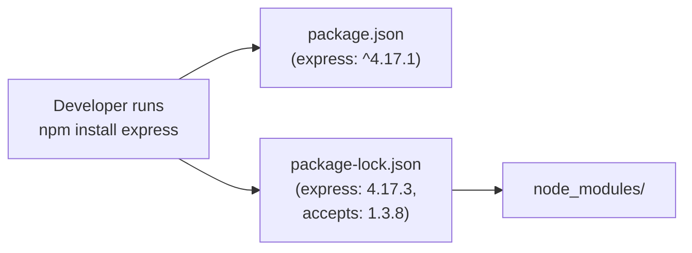

## TL;DR

The `package.json` file is the manifest of your Node.js project, defining metadata, scripts, and dependencies. The `package-lock.json` (or `yarn.lock`) file locks down the *exact* versions of every single dependency (including transitive ones) to guarantee reproducible builds across different machines.

## Mental Model



## How It Works

### Semantic Versioning (SemVer)
Versions are written as `MAJOR.MINOR.PATCH` (e.g., `1.4.2`).
*   `^1.4.2` (Caret): Allows updates to Minor and Patch (e.g., `1.5.0`), but NOT Major.
*   `~1.4.2` (Tilde): Allows updates to Patch only (e.g., `1.4.3`).

### The Lockfile
Because `package.json` uses symbols like `^` and `~`, running `npm install` on two different days could result in different code being installed if the package author released an update.
The `package-lock.json` captures the exact resolved version and a cryptographic hash of the package to ensure everyone gets the exact same code.

## Example

```json
// Inside package.json
{
  "name": "my-app",
  "scripts": {
    "start": "node index.js",
    "dev": "nodemon index.js"
  },
  "dependencies": {
    "express": "^4.18.2" 
  },
  "devDependencies": {
    "jest": "^29.0.0"
  }
}
```

## Common Interview Questions

### Should you commit `package-lock.json` to version control (Git)?
**Yes, absolutely.** If you do not commit the lockfile, your CI/CD server or your coworkers might resolve different versions of transitive dependencies, leading to the classic "it works on my machine" bug.

### What is the difference between `dependencies` and `devDependencies`?
`dependencies` are packages required for your application to run in production (like `express` or `mongoose`). `devDependencies` are only needed for local development and testing (like `jest`, `eslint`, or `nodemon`). When deploying to production, you use `npm install --production` to strictly skip devDependencies and save server space.
