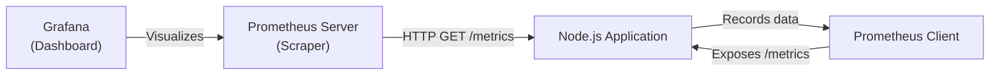

## TL;DR

While logs tell you *what* happened, **Metrics** tell you *how much* or *how often* things are happening. Metrics are numerical data points tracked over time (e.g., "Requests per second", "Average response time", "Memory usage") used to trigger alerts and scale infrastructure.

## Mental Model



## How It Works

There are three primary types of metrics:
1.  **Counters**: Numbers that only go up (e.g., Total HTTP Requests, Total Errors).
2.  **Gauges**: Numbers that go up and down (e.g., Current Active WebSocket connections, Current Memory Usage).
3.  **Histograms**: Tracks the distribution and sizes of events (e.g., 99th percentile HTTP Response Time).

Applications expose these numbers on a dedicated HTTP route (like `/metrics`). A time-series database (like **Prometheus**) regularly scrapes this endpoint.

## Example

```javascript
// Using prom-client
const express = require('express');
const client = require('prom-client');
const app = express();

// 1. Create a counter metric
const requestCounter = new client.Counter({
  name: 'http_requests_total',
  help: 'Total number of HTTP requests',
  labelNames: ['method', 'status']
});

app.get('/api/data', (req, res) => {
    // 2. Increment the metric on use
    requestCounter.inc({ method: 'GET', status: 200 });
    res.send('Data');
});

// 3. Expose the /metrics endpoint for Prometheus to scrape
app.get('/metrics', async (req, res) => {
    res.set('Content-Type', client.register.contentType);
    res.end(await client.register.metrics());
});
```

## Common Interview Questions

### What are RED metrics?
A common microservice observability framework that states you should measure three core things for every service:
- **R**ate: Number of requests per second.
- **E**rrors: Number of those requests that are failing.
- **D**uration: The amount of time the requests take to complete.

### Why not just parse logs to generate metrics?
Parsing gigabytes of JSON logs to count how many 200 OKs happened is computationally expensive and slow. Metrics are extremely lightweight because they are just integers kept in memory and scraped every 15 seconds. They are specifically designed for high-speed alerting (e.g., "CPU > 90% for 2 minutes").
