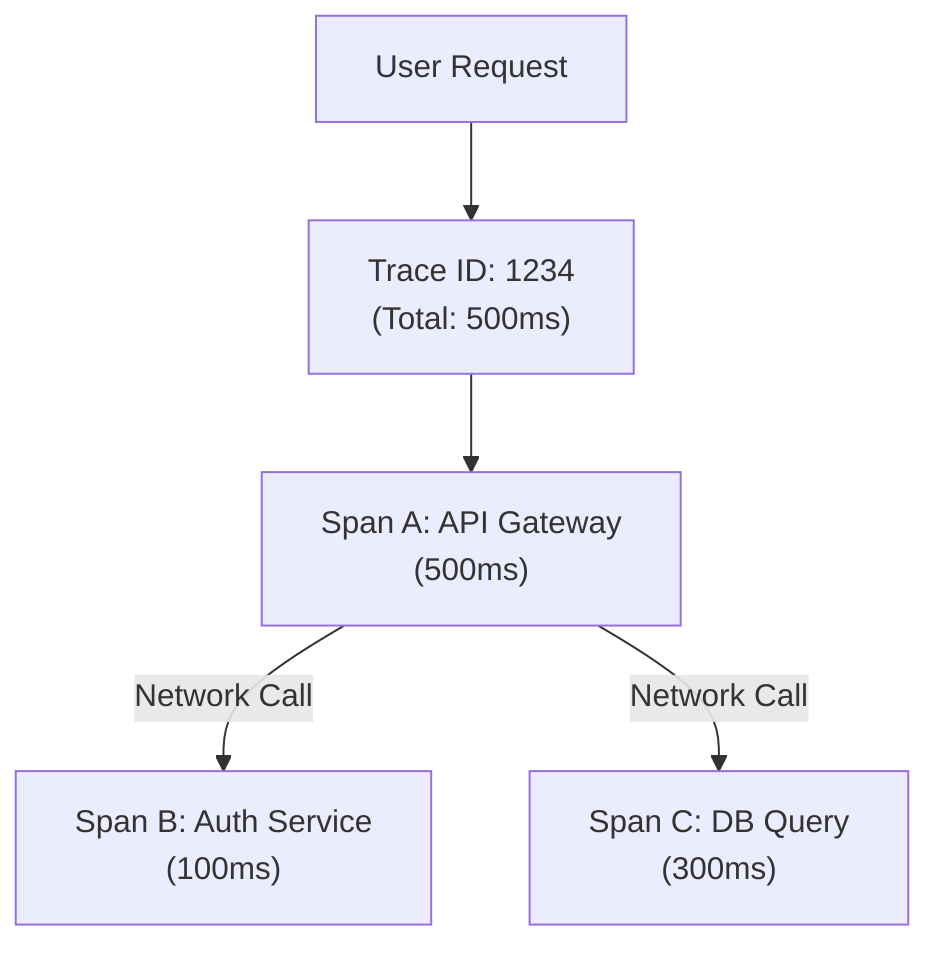

## TL;DR

**Distributed Tracing** tracks a single request as it propagates through a complex microservice architecture. It visually maps out exactly how long the request spent in the API Gateway, the Auth Service, the Database, and the Billing Service, making it easy to spot exactly which service is the bottleneck.

## Mental Model



## How It Works

1.  **Trace ID**: When a request enters the system, the edge router creates a unique `Trace ID` and puts it in the HTTP headers.
2.  **Propagation**: Every service that receives this request extracts the `Trace ID` and includes it in any outgoing requests to downstream services or databases.
3.  **Spans**: Every piece of work done (like an HTTP call or a DB query) creates a "Span" (which has a start time, end time, and the Trace ID) and sends it to a backend like **Jaeger**, **Zipkin**, or **Datadog APM**.
4.  **OpenTelemetry**: The modern, vendor-neutral standard for instrumenting Node.js apps to generate these traces.

## Example

*Modern tracing is usually auto-instrumented (requiring zero code changes to your routes). The OpenTelemetry library patches Node's core `http` and `pg` modules to create spans automatically.*

```javascript
// Usually placed at the very top of your index.js, before ANY other requires
const { NodeTracerProvider } = require('@opentelemetry/sdk-trace-node');
const { HttpInstrumentation } = require('@opentelemetry/instrumentation-http');
const { registerInstrumentations } = require('@opentelemetry/instrumentation');

const provider = new NodeTracerProvider();
provider.register();

// This automatically intercepts all incoming and outgoing HTTP requests
// and generates Trace Spans for them!
registerInstrumentations({
  instrumentations: [new HttpInstrumentation()],
});

// ... Now start your Express app ...
```

## Common Interview Questions

### What is the difference between a Trace and a Span?
A **Trace** represents the entire journey of a single user request through the whole system. A **Span** represents a single, specific unit of work within that trace (e.g., "Calling the Stripe API" is one span, "Querying Postgres" is another span). A trace is a tree of spans.

### What is Context Propagation?
It is the mechanism of passing the Trace ID (and other metadata) from one asynchronous boundary to another. In Node.js, this is particularly difficult because of the Event Loop. OpenTelemetry uses `AsyncLocalStorage` under the hood to ensure the Trace ID is accessible inside promises and callbacks without having to pass it manually as a function argument.
